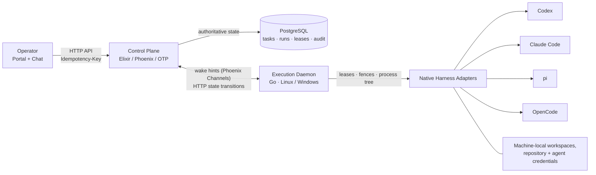

<div align="center">


# Symmetry

**A self-hosted control plane for running AI coding agents on real engineering work.**

[](https://github.com/wxxb789/symmetry/actions/workflows/ci.yml)
[](#project-status)
[](LICENSE)
[](https://elixir-lang.org/)
[](https://go.dev/)
[](https://www.postgresql.org/)

[English](README.md) | [简体中文](README_zh-cn.md)

</div>

---

Symmetry is an **agent orchestration and execution platform** that turns one-off
coding-agent sessions into durable, auditable engineering work. It gives a single
operator a project and Kanban workspace, starts and supervises agent runs, routes
work to execution machines, and keeps authoritative state in PostgreSQL so that
crashes, restarts and stale workers cannot corrupt the record.

It is not another chat wrapper. Symmetry separates **orchestration policy** from
**machine-local execution**: an Elixir/OTP control plane decides what may happen
next, a Go daemon owns the machine, credentials and process tree, and native
adapters speak each coding agent's own protocol — **Codex**, **Claude Code**,
**pi** and **OpenCode** — instead of forcing them through a lowest-common-denominator
dialect.

> **Project status:** actively developed, **pre-0.0.1**, no released version.
> Interfaces, contracts and storage are still changing. Do not deploy this as a
> production system of record yet. See [Project status](#project-status).

## Table of contents

- [Why Symmetry](#why-symmetry)
- [Architecture](#architecture)
- [Native agent harnesses](#native-agent-harnesses)
- [Engineering portal](#engineering-portal)
- [Engineering connections](#engineering-connections)
- [Tech stack](#tech-stack)
- [Getting started](#getting-started)
- [Configuration and protocol](#configuration-and-protocol)
- [Platform support](#platform-support)
- [Project status](#project-status)
- [Repository layout](#repository-layout)
- [Documentation](#documentation)
- [Contributing](#contributing)
- [License](#license)

## Why Symmetry

- **Durable execution, not a long-lived terminal.** Tasks, runs, leases,
  generations, fences and commands are persisted in PostgreSQL. A restarted
  control plane rebuilds coordination state; a restarted daemon reconciles and
  resumes instead of losing work.
- **Machine-local credentials stay local.** Repository credentials, agent
  binaries, workspace paths and environment allowlists live on the execution
  machine. GitHub and Azure DevOps tokens are requested at call time by the
  control plane and never persisted or passed to daemons.
- **One owner per run.** Every run mutation is authorized by runtime epoch, run,
  generation, claim and lease together, with a separate grace window for terminal
  transitions and command acknowledgements. A newer generation always wins.
- **Outcome-first, evidence-bound.** Runs surface outcome, findings, artifacts
  and delivery state, while paginated raw history remains available for
  debugging. A model may propose; deterministic policy accepts.
- **Native harnesses, verified capabilities.** Each adapter probes the installed
  agent version and advertises only the controls it can actually perform —
  no claimed pause, resume or approval that the native tool does not support.
- **Operator control without ambiguity.** Start, guide, pause, resume, cancel and
  retry are explicit, persisted commands with acknowledgement receipts rather
  than fire-and-forget messages.

## Architecture



The repository is a small monorepo with two independently deployable services:

- **`control/`** — the Elixir/OTP/Phoenix **control plane**. It owns orchestration
  APIs, durable state transitions and live coordination, and it serves the
  operator portal and API.
- **`daemon/`** — the Go **execution daemon**. It runs on an execution machine,
  owns machine-local agent and repository credentials, and reports execution
  state to the control plane over a language-neutral protocol.
- **`contracts/`** — canonical **JSON Schema** wire contracts plus generated
  TypeScript (Effect 3) and Go types, shared by both sides.
- **PostgreSQL** is the authoritative store for control state, tasks, runs,
  leases and audit history. Live OTP state is reconstructible coordination
  state, never durable business truth.

The control plane never executes coding agents directly, and the daemon never
owns shared orchestration truth. The cross-language contract is documented in
[`docs/protocol-v1.md`](docs/protocol-v1.md).

## Native agent harnesses

Symmetry integrates with coding agents through native adapters in the Go daemon.
Each adapter is probed for its installed version and reports only verified
capabilities; unsupported controls fail closed instead of being emulated.

| Harness | Transport | Control model |
| --- | --- | --- |
| **Codex** | `codex app-server` over stdio JSON-RPC | Native thread/turn lifecycle; capability-probed steering, interrupt and approval mapping |
| **Claude Code** | Headless CLI with JSON/stream-JSON output and explicit session resume | Next-turn guidance and process cancellation; no claimed safe pause without verified native support |
| **pi** | Native `--mode rpc`, JSONL stdin/stdout | Prompt/steer/abort/session RPC mapping |
| **OpenCode** | Daemon-owned loopback `serve`, HTTP API + SSE | Session/prompt/abort/event mapping with API-version-verified permissions |

A `generic` adapter remains for legacy commands and deterministic fake-agent
tests. Retained sessions, handoff and recovery are bounded by tested native
versions and workspace fingerprints. See
[`docs/design/harness.md`](docs/design/harness.md).

## Engineering portal

The operator workspace is served at **`/portal`** and establishes a signed
browser session from the configured operator token (never stored in browser
storage). It groups work into projects and Kanban work items, connects
repositories and CI, shows runtime and connection health, and presents agent runs
with outcome-first detail while retaining paginated raw execution history.

- **Projects and board** — create, edit, move and run work items; assign agent
  profiles and machine-local workspace bindings.
- **Runs and supervision** — start explicitly, then provide input, deliver
  durable guidance, answer consequential decisions, pause, resume, cancel or
  retry failed and cancelled work.
- **Chat at `/portal#chat`** — workspace, project and run conversations. Start
  work, inspect progress and deliver guidance. Ordinary questions are answered
  from recorded evidence and do **not** interrupt execution; the control plane
  does not make an extra language-model call.
- **Attention workspace** — a single place for goals, blockers and pending
  decisions.

See [`docs/goal-02-runbook.md`](docs/goal-02-runbook.md) and
[`docs/goal-04-runbook.md`](docs/goal-04-runbook.md).

## Engineering connections

GitHub and Azure DevOps connections import externally owned work, bind code and
CI resources to projects, and refresh pull-request, review and pipeline state.

Credentials are deliberately **not stored by Symmetry**. The control plane runs
where the authenticated `gh` and `az` CLIs are available, requests tokens at call
time, and keeps them inside the provider request process. Nothing is written to
PostgreSQL or sent to execution daemons. See
[`docs/goal-03-runbook.md`](docs/goal-03-runbook.md).

## Tech stack

| Layer | Technology |
| --- | --- |
| Control plane | Elixir 1.20, Erlang/OTP 29, Phoenix 1.8, Ecto, Oban, Bandit |
| Execution daemon | Go 1.27, native harness adapters, process-tree containment |
| State | PostgreSQL 18 (authoritative), Phoenix Channels for wake hints only |
| Contracts | JSON Schema Draft 7, generated TypeScript (Effect 3) and Go DTOs |
| Portal | Phoenix-served workspace; React/Vite/TanStack/Effect frontend is the target under goal 0007 |
| Deployment | Docker Compose for development, Nginx TLS edge for production |
| Verification | ExUnit, Go tests, Node contract tests, Playwright browser acceptance, `pnpm contracts:check` |

## Getting started

Prerequisites: **Elixir 1.20 / Erlang OTP 29** for `control/`, **Go 1.27** for
`daemon/`, and **PostgreSQL 18** (or compatible). For the container path, install
Docker with Compose.

### Docker Compose (trusted-local development)

The default `compose.yaml` is a trusted-local stack. It migrates PostgreSQL,
starts `control`, and runs a deterministic fake agent through the real daemon
execution path. PostgreSQL data is kept in the `postgres_data` volume and the
control plane is published only to `127.0.0.1:4000` over HTTP.

```sh
docker compose config
docker compose up --build
# open http://127.0.0.1:4000/portal
docker compose down
```

Use `docker compose down -v` only when intentionally deleting local database
data and the persisted GitHub/Azure CLI login state. The daemon image is a static
Go binary and deliberately contains no machine-local coding-agent or repository
credentials.

### Local development (native Linux)

Start PostgreSQL locally, then run the services from separate terminals:

```sh
cd control
mix deps.get
mix ecto.setup
mix phx.server
```

```sh
cd daemon
go test ./...
go run ./cmd/symmetry-daemon -config /absolute/path/to/daemon.json
```

The local control plane uses port `4000`, and `/portal` accepts the development
operator token. A daemon using a plain HTTP URL must set
`allow_insecure_http: true`; use that only for an explicitly trusted local or
container network. Agent commands, workspace paths and allowed environment
variables remain machine-local configuration. Start from the daemon
configuration example in [`docs/goal-01-runbook.md`](docs/goal-01-runbook.md)
and replace its paths with local absolute paths. The
`cmd/symmetry-daemon/testdata` configuration is validation test data, not a
runnable local profile.

### Production topology

`compose.production.yaml` is an independent production topology: Nginx is the
only public service, terminating TLS on ports `80` and `443`, while the control
plane remains on a private Docker network. It requires deployment-provided
database, application, enrollment, operator and TLS credentials. See the
production deployment section in
[`docs/goal-01-runbook.md`](docs/goal-01-runbook.md).

## Configuration and protocol

- **Operator API** — create tasks at `POST /api/v1/tasks` and durable cancel,
  input, guidance, pause or resume instructions at
  `POST /api/v1/tasks/{task_id}/commands`. Supervisory controls require a
  compatible runtime and an explicit generation. Both write operations require
  an `Idempotency-Key`; task commands return command resources rather than task
  snapshots.
- **Daemon protocol** — the daemon registers, claims work, renews leases,
  journals events, records evidence and usage, and acknowledges commands over
  the versioned HTTP contract. Phoenix Channels carry wake hints only; HTTP
  performs every consequential transition.
- **Agent input** — `input_mode: "goal"` sends the plain-text task goal, while
  `input_mode: "json"` sends one JSON envelope with `goal` and structured
  `input`. The separate `provider_access: true` profile option explicitly
  enables the scoped provider broker for that JSON consumer.
- **Contracts** — JSON Schema Draft 7 is the wire authority. Regenerate and
  verify with `pnpm contracts:generate` and `pnpm contracts:check`.

See [`docs/protocol-v1.md`](docs/protocol-v1.md) for lifecycle, status and
response semantics.

## Platform support

- **Control plane** — native **Linux**. Run it on Windows or macOS through
  Docker; Kubernetes uses the same Linux container image.
- **Execution daemon** — native **Linux** and **Windows**. FreeBSD is
  unsupported. Native macOS daemon support and verification are deferred and
  must not be treated as supported.
- **Requirements** — Linux execution requires `PIDFD_SIGNAL_PROCESS_GROUP`
  (Linux 6.9 or later, permitted by the host security policy). The daemon checks
  this capability before launch and fails closed without numeric-PID fallback.
- **Time** — execution machines must synchronize with NTP. Clock skew beyond the
  lease safety margin is reported as a diagnostic warning.

See [`docs/goal-process-stop-testing.md`](docs/goal-process-stop-testing.md) for
the owned process-group/Windows Job boundary and restart-recovery limitations.

## Project status

> **Symmetry is in active development and is not ready for a 0.0.1 release.**
> There is no supported release, tag or upgrade path yet. Wire contracts,
> database migrations, configuration keys and APIs may change between commits
> without notice. Treat every checkout as a development snapshot, keep backups,
> and do not use it as a production system of record.

What is implemented and continuously verified:

- The durable orchestration core: machines, runtimes, tasks, runs, leases,
  transitions, commands and events persisted in PostgreSQL, with fenced claims,
  workspace isolation, process-tree supervision, wake notification, polling
  fallback, reconciliation, human input and durable local outboxes.
- The operator portal, GitHub/Azure DevOps connections, scoped chat and
  supervisory controls.
- Native Codex, Claude Code, pi and OpenCode adapters with capability probing
  and retained-session recovery.
- JSON Schema contracts with generated TypeScript/Go types and an executable
  fixture corpus.

The next-stage design and work plan are normative targets, not completion
claims:

- [Design decisions](docs/design/README.md) — the fixed architecture and
  boundaries.
- [Goals](docs/goals/README.md) — the bounded outcomes currently being delivered;
  historical goals 0001–0005 are archived under
  [`docs/goals/archive/`](docs/goals/archive/).

## Repository layout

```text
symmetry/
├── control/                 # Elixir/Phoenix control plane and operator portal
│   └── lib/symmetry_control_web/   # HTTP API, channels, portal HTML
├── daemon/                  # Go execution daemon
│   └── internal/harness/    # Codex, Claude Code, pi, OpenCode adapters
├── contracts/               # JSON Schema sources + generated TS/Go/Effect types
├── browser/                 # Playwright acceptance tests
├── frontend/                # React/Vite frontend target (goal 0007)
├── docs/                    # design, goals, runbooks, evidence
├── docker/                  # container and edge configuration
├── compose.yaml             # trusted-local development stack
└── compose.production.yaml  # Nginx TLS edge production topology
```

## Documentation

| Document | Contents |
| --- | --- |
| [Protocol v1](docs/protocol-v1.md) | Wire contract, lifecycle, authorization and recovery |
| [Design decisions](docs/design/README.md) | Fixed core architecture and boundaries |
| [Goal 1 runbook](docs/goal-01-runbook.md) | Control-plane and daemon configuration, operations |
| [Goal 2 runbook](docs/goal-02-runbook.md) | Portal, projects, Kanban and run workflows |
| [Goal 3 runbook](docs/goal-03-runbook.md) | GitHub and Azure DevOps connections and synchronization |
| [Goal 4 runbook](docs/goal-04-runbook.md) | Chat, durable guidance and supervisory controls |
| [Harness design](docs/design/harness.md) | Native adapter contract and capability verification |
| [Quality policy](docs/design/quality.md) | Risk routing, evidence and acceptance standards |

## Contributing

This project follows the contributor contract in [`AGENTS.md`](AGENTS.md):
bounded changes with a complete behavior contract, preserved fences and
idempotency, and evidence-bound verification. Read the applicable
`AGENTS.md` and the design documents before editing, and run the checks that the
changed risk surface requires. Missing checks remain missing — never assumed
passed.

## License

Released under the [MIT License](LICENSE).

Copyright (c) 2026 Symmetry contributors.
