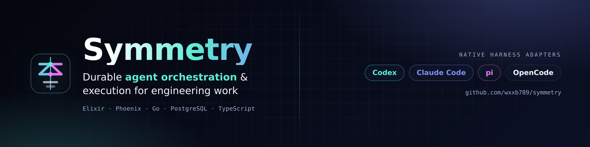
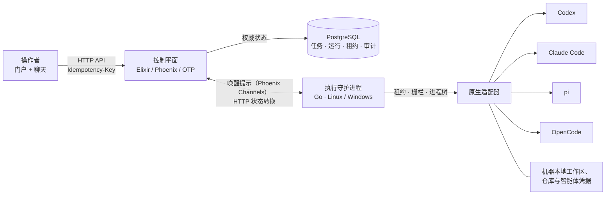

<div align="center">



# Symmetry

**面向真实工程工作的自托管 AI 编码智能体控制平面。**

[](https://github.com/wxxb789/symmetry/actions/workflows/ci.yml)
[](#项目状态)
[](LICENSE)
[](https://elixir-lang.org/)
[](https://go.dev/)
[](https://www.postgresql.org/)

[English](README.md) | [简体中文](README_zh-cn.md)

</div>

---

Symmetry 是一个**智能体（agent）编排与执行平台**，把一次性的编码智能体会话转化为持久、可审计的工程工作。它为单一操作者提供项目与看板工作区，用于启动与监督智能体运行、把工作路由到执行机器，并将权威状态保存在 PostgreSQL 中，因此崩溃、重启与过期 worker 都无法破坏可信记录。

它不是又一个聊天外壳。Symmetry 将**编排策略**与**机器本地执行**分离：Elixir/OTP 控制平面决定下一步允许发生什么，Go 守护进程掌握机器、凭据与进程树，而原生适配器直接使用各编码智能体自己的协议——**Codex**、**Claude Code**、**pi** 与 **OpenCode**——而不是把它们强行塞进一个最低公分母式的方言。

> **项目状态：** 处于积极开发中，**pre-0.0.1**，尚无发布版本。接口、契约与存储仍在变化。请勿将其作为生产系统记录部署。参见[项目状态](#项目状态)。

## 目录

- [为什么选择 Symmetry](#为什么选择-symmetry)
- [架构](#架构)
- [原生智能体适配器](#原生智能体适配器)
- [工程门户](#工程门户)
- [工程连接](#工程连接)
- [技术栈](#技术栈)
- [快速开始](#快速开始)
- [配置与协议](#配置与协议)
- [平台支持](#平台支持)
- [项目状态](#项目状态)
- [仓库结构](#仓库结构)
- [文档](#文档)
- [贡献](#贡献)
- [许可证](#许可证)

## 为什么选择 Symmetry

- **持久化执行，而非长期存活终端。** 任务、运行、租约、代际、栅栏与命令都持久化在 PostgreSQL 中。控制平面重启后会重建协调状态；守护进程重启后会进行对账并恢复，而不是丢失工作。
- **机器本地凭据留在本地。** 仓库凭据、智能体二进制、工作区路径与环境白名单都位于执行机器上。GitHub 与 Azure DevOps 令牌由控制平面在调用时获取，绝不持久化，也绝不传递给守护进程。
- **每次运行只有一个所有者。** 每次运行变更都由运行时 epoch、run、generation、claim 与 lease 共同授权，并为终止转换与命令确认保留独立宽限期。更新的代际总是胜出。
- **结果优先，证据绑定。** 运行会呈现结果、发现、产物与交付状态，同时保留分页的原始历史用于调试。模型可以提议，但由确定性策略接受。
- **原生适配器，能力经核验。** 每个适配器都会探测已安装的智能体版本，只声明它确实能执行的控制——不会声称原生工具并不支持的暂停、恢复或审批。
- **操作者控制明确无歧义。** 启动、指导、暂停、恢复、取消与重试都是显式、持久化的命令，并带有确认回执，而不是发后即忘的消息。

## 架构



本仓库是一个小型 monorepo，包含两个可独立部署的服务：

- **`control/`** —— Elixir/OTP/Phoenix **控制平面**。它拥有编排 API、持久化状态转换与实时协调，并对外提供操作者门户与 API。
- **`daemon/`** —— Go **执行守护进程**。它运行在执行机器上，掌握机器本地的智能体与仓库凭据，并通过语言中立的协议向控制平面报告执行状态。
- **`contracts/`** —— 规范 **JSON Schema** 线上契约，以及生成的 TypeScript（Effect 3）与 Go 类型，供两端共享。
- **PostgreSQL** 是控制状态、任务、运行、租约与审计历史的权威存储。OTP 实时状态是可重建的协调状态，绝不是持久业务真相。

控制平面从不直接执行编码智能体，守护进程也从不拥有共享编排真相。跨语言契约记录在 [`docs/protocol-v1.md`](docs/protocol-v1.md)。

## 原生智能体适配器

Symmetry 通过 Go 守护进程中的原生适配器与编码智能体集成。每个适配器都会探测已安装版本，只报告经验证的能力；不支持的控制会以失败关闭（fail closed），而不是被模拟。

| 适配器 | 传输方式 | 控制模型 |
| --- | --- | --- |
| **Codex** | 基于 stdio JSON-RPC 的 `codex app-server` | 原生 thread/turn 生命周期；经能力探测的 steering、interrupt 与审批映射 |
| **Claude Code** | 带 JSON/stream-JSON 输出与显式会话恢复的 headless CLI | 下一轮指导与进程取消；在未经核验的原生支持前不声称安全暂停 |
| **pi** | 原生 `--mode rpc`，JSONL stdin/stdout | prompt/steer/abort/session RPC 映射 |
| **OpenCode** | 守护进程拥有的环回 `serve`，HTTP API + SSE | 经 API 版本核验权限的 session/prompt/abort/event 映射 |

`generic` 适配器保留用于旧式命令与确定性 fake-agent 测试。保留会话、交接与恢复受已测试的原生版本与工作区指纹约束。参见 [`docs/design/harness.md`](docs/design/harness.md)。

## 工程门户

操作者工作区位于 **`/portal`**，使用配置的操作者令牌建立签名浏览器会话（绝不存储在浏览器存储中）。它把工作组织为项目与看板工作项，连接仓库与 CI，展示运行时与连接健康状态，并以结果优先的方式呈现智能体运行，同时保留分页的原始执行历史。

- **项目与看板** —— 创建、编辑、移动与运行工作项；分配智能体配置与机器本地工作区绑定。
- **运行与监督** —— 显式启动，然后提供输入、传递持久指导、回答关键决策、暂停、恢复、取消或重试失败与已取消的工作。
- **`/portal#chat` 聊天** —— 工作区、项目与运行会话。启动工作、查看进度并传递指导。普通问题基于已记录证据回答，**不会**中断执行；控制平面不会额外调用语言模型。
- **注意力工作区** —— 集中查看目标、阻塞与待决决策。

参见 [`docs/goal-02-runbook.md`](docs/goal-02-runbook.md) 与 [`docs/goal-04-runbook.md`](docs/goal-04-runbook.md)。

## 工程连接

GitHub 与 Azure DevOps 连接可导入外部拥有的工作，把代码与 CI 资源绑定到项目，并刷新拉取请求、评审与流水线状态。

凭据被刻意**不由 Symmetry 存储**。控制平面运行在已认证 `gh` 与 `az` CLI 可用的位置，在调用时请求令牌，并将其保留在 provider 请求进程内。任何内容都不会写入 PostgreSQL，也不会发送给执行守护进程。参见 [`docs/goal-03-runbook.md`](docs/goal-03-runbook.md)。

## 技术栈

| 层 | 技术 |
| --- | --- |
| 控制平面 | Elixir 1.20、Erlang/OTP 29、Phoenix 1.8、Ecto、Oban、Bandit |
| 执行守护进程 | Go 1.27、原生适配器、进程树管控 |
| 状态 | PostgreSQL 18（权威）、Phoenix Channels 仅用于唤醒提示 |
| 契约 | JSON Schema Draft 7、生成的 TypeScript（Effect 3）与 Go DTO |
| 门户 | Phoenix 提供的工作区；React/Vite/TanStack/Effect 前端是 goal 0007 的目标 |
| 部署 | 开发用 Docker Compose，生产用 Nginx TLS 边缘 |
| 验证 | ExUnit、Go 测试、Node 契约测试、Playwright 浏览器验收、`pnpm contracts:check` |

## 快速开始

前置条件：`control/` 需要 **Elixir 1.20 / Erlang OTP 29**，`daemon/` 需要 **Go 1.27**，以及 **PostgreSQL 18**（或兼容版本）。容器路径需要安装带 Compose 的 Docker。

### Docker Compose（可信本地开发）

默认的 `compose.yaml` 是可信本地栈。它会迁移 PostgreSQL、启动 `control`，并通过真实守护进程执行路径运行确定性 fake agent。PostgreSQL 数据保存在 `postgres_data` 卷中，控制平面仅通过 HTTP 发布到 `127.0.0.1:4000`。

```sh
docker compose config
docker compose up --build
# 打开 http://127.0.0.1:4000/portal
docker compose down
```

仅在有意删除本地数据库数据与持久化的 GitHub/Azure CLI 登录状态时，才使用 `docker compose down -v`。守护进程镜像是一个静态 Go 二进制，刻意不包含机器本地编码智能体或仓库凭据。

### 本地开发（原生 Linux）

在本地启动 PostgreSQL，然后在不同终端运行各服务：

```sh
cd control
mix deps.get
mix ecto.setup
mix phx.server
```

```sh
cd daemon
go test ./...
go run ./cmd/symmetry-daemon -config /absolute/path/to/daemon.json
```

本地控制平面使用端口 `4000`，`/portal` 接受开发操作者令牌。使用明文 HTTP URL 的守护进程必须设置 `allow_insecure_http: true`；仅可在明确受信的本地或容器网络中使用。智能体命令、工作区路径与允许的环境变量仍为机器本地配置。请从 [`docs/goal-01-runbook.md`](docs/goal-01-runbook.md) 的守护进程配置示例开始，并将其路径替换为本地绝对路径。`cmd/symmetry-daemon/testdata` 配置是验证测试数据，不是可运行的本地配置。

### 生产拓扑

`compose.production.yaml` 是独立的生产拓扑：Nginx 是唯一对外服务，在端口 `80` 与 `443` 上终止 TLS，而控制平面保持在私有 Docker 网络中。它需要由部署方提供的数据库、应用、注册、操作者与 TLS 凭据。参见 [`docs/goal-01-runbook.md`](docs/goal-01-runbook.md) 的生产部署章节。

## 配置与协议

- **操作者 API** —— 在 `POST /api/v1/tasks` 创建任务，在 `POST /api/v1/tasks/{task_id}/commands` 创建持久的取消、输入、指导、暂停或恢复指令。监督控制需要兼容的运行时与显式代际。两类写操作都需要 `Idempotency-Key`；任务命令返回命令资源而非任务快照。
- **守护进程协议** —— 守护进程通过版本化 HTTP 契约注册、领取工作、续租、记录事件、记录证据与用量，并确认命令。Phoenix Channels 仅承载唤醒提示；所有关键转换都通过 HTTP 执行。
- **智能体输入** —— `input_mode: "goal"` 发送纯文本任务目标，`input_mode: "json"` 发送包含 `goal` 与结构化 `input` 的单个 JSON 信封。单独的 `provider_access: true` 配置项为该 JSON 消费者显式启用受限 provider broker。
- **契约** —— JSON Schema Draft 7 是线上权威。使用 `pnpm contracts:generate` 重新生成，使用 `pnpm contracts:check` 验证。

参见 [`docs/protocol-v1.md`](docs/protocol-v1.md) 了解生命周期、状态与响应语义。

## 平台支持

- **控制平面** —— 原生 **Linux**。Windows 或 macOS 请通过 Docker 运行；Kubernetes 使用相同的 Linux 容器镜像。
- **执行守护进程** —— 原生支持 **Linux** 与 **Windows**。不支持 FreeBSD。原生 macOS 守护进程支持与验证已推迟，绝不应视为受支持。
- **要求** —— Linux 执行需要 `PIDFD_SIGNAL_PROCESS_GROUP`（Linux 6.9 或更高版本，且主机安全策略允许）。守护进程在启动前检查该能力，并在缺少时以失败关闭，且不回退到数字 PID。
- **时间** —— 执行机器必须与 NTP 同步。超出租约安全边距的时钟偏差会作为诊断警告报告。

参见 [`docs/goal-process-stop-testing.md`](docs/goal-process-stop-testing.md) 了解自有的进程组/Windows Job 边界与重启恢复限制。

## 项目状态

> **Symmetry 正在积极开发中，尚未准备好 0.0.1 版本发布。**
> 目前没有受支持的发布、标签或升级路径。线上契约、数据库迁移、配置键与 API 可能在提交之间随时变化，恕不另行通知。请把每次检出都视为开发快照，做好备份，且不要将其作为生产系统记录使用。

已实现并持续验证的内容：

- 持久编排核心：机器、运行时、任务、运行、租约、转换、命令与事件持久化于 PostgreSQL，具备栅栏化领取、工作区隔离、进程树监督、唤醒通知、轮询回退、对账、人工输入与持久本地发件箱。
- 操作者门户、GitHub/Azure DevOps 连接、受限聊天与监督控制。
- 原生 Codex、Claude Code、pi 与 OpenCode 适配器，具备能力探测与保留会话恢复。
- JSON Schema 契约，含生成的 TypeScript/Go 类型与可执行 fixture 语料库。

下一阶段的设计与工作计划是规范目标，而非完成声明：

- [设计决策](docs/design/README.md) —— 固定架构与边界。
- [目标](docs/goals/README.md) —— 当前交付的受约束成果；历史目标 0001–0005 已归档于 [`docs/goals/archive/`](docs/goals/archive/)。

## 仓库结构

```text
symmetry/
├── control/                 # Elixir/Phoenix 控制平面与操作者门户
│   └── lib/symmetry_control_web/   # HTTP API、channels、portal HTML
├── daemon/                  # Go 执行守护进程
│   └── internal/harness/    # Codex、Claude Code、pi、OpenCode 适配器
├── contracts/               # JSON Schema 源码 + 生成的 TS/Go/Effect 类型
├── browser/                 # Playwright 验收测试
├── frontend/                # React/Vite 前端目标（goal 0007）
├── docs/                    # 设计、目标、runbook、证据
├── docker/                  # 容器与边缘配置
├── compose.yaml             # 可信本地开发栈
└── compose.production.yaml  # Nginx TLS 边缘生产拓扑
```

## 文档

| 文档 | 内容 |
| --- | --- |
| [Protocol v1](docs/protocol-v1.md) | 线上契约、生命周期、授权与恢复 |
| [设计决策](docs/design/README.md) | 固定核心架构与边界 |
| [Goal 1 runbook](docs/goal-01-runbook.md) | 控制平面与守护进程配置、运维 |
| [Goal 2 runbook](docs/goal-02-runbook.md) | 门户、项目、看板与运行工作流 |
| [Goal 3 runbook](docs/goal-03-runbook.md) | GitHub 与 Azure DevOps 连接及同步 |
| [Goal 4 runbook](docs/goal-04-runbook.md) | 聊天、持久指导与监督控制 |
| [Harness 设计](docs/design/harness.md) | 原生适配器契约与能力验证 |
| [质量策略](docs/design/quality.md) | 风险路由、证据与验收标准 |

## 贡献

本项目遵循 [`AGENTS.md`](AGENTS.md) 中的贡献者契约：具有完整行为契约的有界变更、保留栅栏与幂等性、以及证据绑定的验证。编辑前请阅读适用的 `AGENTS.md` 与设计文档，并运行变更风险面所需的检查。缺失的检查仍然是缺失的——绝不可假定其通过。

## 许可证

基于 [MIT 许可证](LICENSE) 发布。

Copyright (c) 2026 Symmetry contributors.
