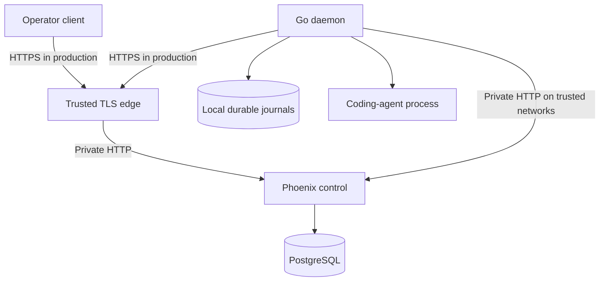
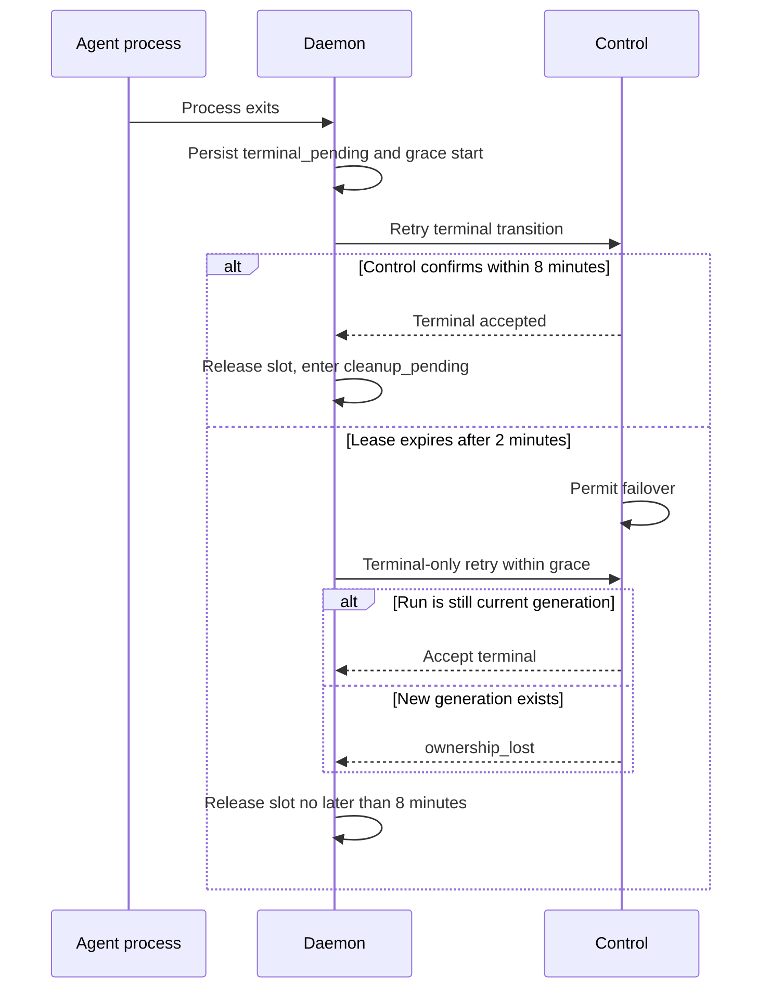
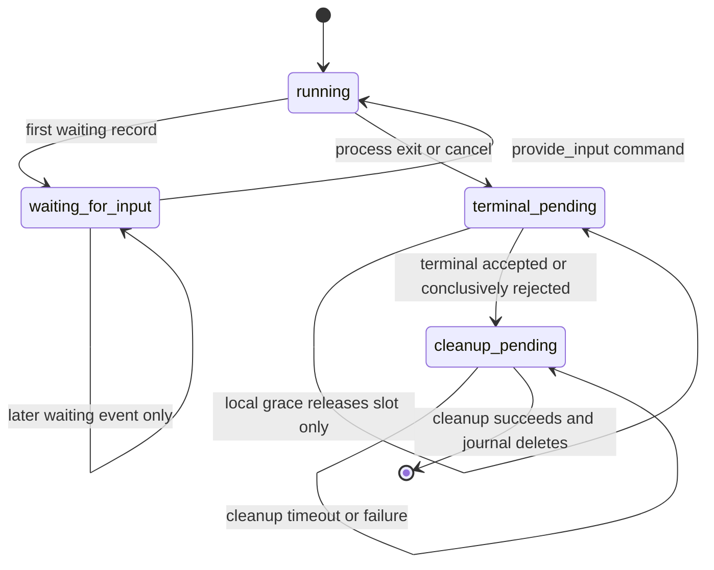

# Goal 01 Review Findings Remediation - Plan

## Goal Capsule

- **Objective:** Close the 15 validated Goal 01 review findings and the session-directed REST and command contract corrections without expanding into unproven residual risks.
- **Outcome:** The orchestration protocol, daemon liveness model, operator read surfaces, deployment boundary, and cross-language contracts are internally consistent and covered by deterministic tests.
- **Execution:** Code changes on `main`, with one verified commit for each meaningful work unit and no pull request.
- **Product authority:** `docs/goals/01-goal.md` defines the Goal 01 outcome; the session-settled decisions in this artifact govern this remediation when they narrow or clarify that goal.
- **Compatibility boundary:** Breaking protocol changes are allowed before `1.0.0`; compatibility becomes a release constraint at `1.0.0`.
- **Open blockers:** None. All product and contract decisions required for planning are resolved.
- **Stop condition:** All requirements below pass focused and full release validation, and a follow-up review reports no remaining actionable finding in this scope.

---

## Product Contract

### Summary

Remediate the validated Goal 01 reliability, protocol, deployment, and observability gaps while the project is still in rapid development. Replace the protocol v1 contract atomically across control, daemon, documentation, tests, and deployment assets rather than preserving legacy aliases.

### Problem Frame

Goal 01 has a working durable control plane and execution daemon, but a second full review found failure sequences that can block run progress, retain capacity indefinitely, or make the documented Compose path unusable. The control plane also persists runtime and execution history that operators cannot read through the supported API. Because the project is pre-`1.0.0`, the correct response is one coherent contract correction rather than compatibility scaffolding around behavior that is not yet released as stable.

### Requirements

**Deployment and transport**

- R1. Externally reachable production traffic must be HTTPS-only. TLS terminates at a trusted reverse proxy or load balancer, while explicitly trusted private networks such as the local Docker network may use HTTP. The control service must not trust client-supplied forwarded-protocol headers unless the request crossed the trusted proxy boundary.
- R2. The local Compose stack must use the trusted-private-network HTTP path and must prove that the daemon enrolls, receives work, and completes a task.

**REST protocol v1**

- R3. Protocol v1 must be replaced atomically with resource-oriented routes and purpose-appropriate HTTP methods. Read operations use GET, resource creation uses POST, idempotent resource writes use PUT, partial updates use PATCH, and DELETE is used only for actual deletion. No legacy route aliases or deprecation bridge is required before `1.0.0`.
- R4. Cancellation and consequential human input must create durable task-scoped command resources with `Idempotency-Key`. Commands may bind to a run and generation when execution exists. Control applies queued or unclaimed cancellation atomically, while the daemon applies commands for claimed execution. New human-input commands must bind atomically to the current waiting generation.
- R5. A successful bulk event append must return a bounded acknowledgement, preferably `204 No Content`, so an already-committed append cannot exceed the daemon response limit and enter a permanent replay loop.

**Operator observability**

- R6. Operator-authenticated runtime collection and detail resources must expose machine identity, online/offline state, last heartbeat, connection epoch, capacity, reserved capacity, and active runs from PostgreSQL-backed state.
- R7. Operators must be able to read both a unified task timeline and separate run event, transition, and command collections. The unified timeline is newest-first with an opaque `before` cursor. Separate collections are oldest-first with an opaque `after` cursor. Pagination defaults to 100 items and rejects limits above 500.
- R8. The task read model must expose the current waiting-for-input question and relevant command state without requiring direct database access.

**Daemon liveness and recovery**

- R9. Execution ownership uses a two-minute failover lease plus an eight-minute terminal-only grace. Entering terminal delivery stops ordinary lease renewal and active reconciliation for that run. After lease expiry, the old generation may submit terminal delivery or acknowledgement only while it remains the task's current generation. A newer generation always wins. The daemon releases its local slot on acknowledgement or after at most eight minutes while retaining durable delivery state.
- R10. Lease maintenance must run independently from polling, reconciliation, outbox delivery, and workspace cleanup. The default lease is two minutes, renewal begins with about 90 seconds remaining, and an individual control request may wait up to 15 seconds.
- R11. Workspace cleanup attempts default to a two-minute timeout configurable from 10 seconds through 10 minutes. Timeout or failure retains the journal and workspace reservation; retries are paced and shutdown-cancellable, remain possible after restart, do not reacquire an execution slot, and cannot block daemon shutdown indefinitely.
- R12. Repeated `waiting_for_input` agent records remain durable events but coalesce to one pending lifecycle transition. A later input must be able to resume the run and drain its terminal transition.

**Cross-language contract integrity**

- R13. An omitted task `input` is represented as `null`; an explicitly empty input remains `{}`. PostgreSQL, control DTOs, Go protocol types, validators, and agent JSON framing must preserve that distinction.
- R14. Interactive profiles require `input_mode: "json"`. The configuration must reject `interactive: true` with `input_mode: "goal"` until a plain-text follow-up contract is deliberately designed. Accepted interactive profiles must use the same newline-delimited JSON record framing for the initial input and every later `provide_input` command.
- R15. API clients must reject missing required fields, invalid types, and state-dependent invariant violations while accepting unknown additive fields. Existing field semantics may change before `1.0.0` only through an atomic control/daemon/docs/tests update.
- R16. Unknown or invalid operator credentials return `401 unauthenticated`; a valid credential used against a resource or credential class it does not own returns `403 forbidden`.
- R17. Startup control operations, including terminal-journal delivery, enrollment, and session registration, must fail fast for permanent client errors, retry transport failures and retryable server responses, and honor `Retry-After` where supplied.
- R18. Every untrusted value destined for PostgreSQL JSONB must reject `U+0000` before entering a transaction and return the protocol's invalid-request response rather than a database exception.

### Key Decisions

- **HTTPS boundary (Governs R1, R2):** Production is HTTPS-only at the external boundary; trusted private networks may use HTTP. (session-settled: user-approved — chosen over direct Phoenix TLS everywhere: proxy termination preserves production security without making local Compose carry certificates.)
- **REST replacement (Governs R3):** Replace protocol v1 atomically with purpose-appropriate REST methods and resource routes. (session-settled: user-directed — chosen over retaining GET/POST action routes: the greenfield protocol should express resource semantics directly.)
- **Durable commands (Governs R4):** Cancellation and human input create task-scoped command resources with optional run binding. (session-settled: user-approved — chosen over making queued cancellation an exception: control can apply pre-execution cancellation while preserving one audit model.)
- **Bounded event acknowledgement (Governs R5):** Event append returns a bounded success response because callers already own event identities and need reliable acknowledgement.
- **History surfaces (Governs R6, R7, R8):** Provide both a unified timeline and separate resource collections with view-specific ordering. (session-settled: user-directed — chosen over a single history representation: inspection and replay have different ordering needs.)
- **Terminal ownership grace (Governs R9):** Keep two-minute failover while allowing terminal-only delivery for up to eight minutes when no newer generation exists. (session-settled: user-approved — chosen over either strict two-minute terminal rejection or blocking reassignment for eight minutes: preserve recovery without weakening newer-generation fencing.)
- **Lease tolerance (Governs R10):** Use independent lease maintenance with a two-minute lease and 15-second request tolerance. (session-settled: user-approved — chosen over short single-reactor budgets: coding-agent runs should tolerate temporary connection failure.)
- **Cleanup tolerance (Governs R11):** Use a configurable two-minute cleanup timeout and durable retry. (session-settled: user-approved — chosen over unbounded cleanup: a local Git operation must not stop daemon progress.)
- **Waiting transition coalescing (Governs R12):** Preserve every waiting event but enqueue only one pending waiting lifecycle transition so repeated context cannot block progress.
- **Input absence (Governs R13):** Preserve the distinction between omitted input and an explicitly empty object. (session-settled: user-directed — chosen over canonicalizing both to an empty object: callers need to retain intent.)
- **Interactive framing (Governs R14):** Interactive execution uses one JSON record contract only for now. (session-settled: user-approved — chosen over mixed plain-text and JSON framing: one stable stream contract prevents mid-run parser changes.)
- **Strict required contract (Governs R15):** Reject missing required fields and invalid invariants while accepting unknown additive fields. (session-settled: user-approved — chosen over either sparse acceptance or fail-on-unknown parsing: required semantics stay strict without adding low-value parser rigidity.)
- **Authentication semantics (Governs R16):** Invalid credentials are unauthenticated; valid credentials with insufficient authority are forbidden so status codes retain their standard meaning.
- **Retry classification (Governs R17):** Retry only failures that can recover without configuration or credential changes so permanent failures remain diagnosable.
- **JSONB compatibility (Governs R18):** Reject JSONB-incompatible input at the protocol boundary so callers receive deterministic invalid-request errors instead of database exceptions.
- **Compatibility (Governs R3, R15):** Do not preserve pre-`1.0.0` protocol compatibility. (session-settled: user-directed — chosen over aliases and deprecation bridges: rapid development benefits from one corrected contract.)
- **Scope (Governs R1-R18):** Fix the 15 validated findings, the user-directed REST replacement and task-command contract, and their required tests only. (session-settled: user-approved — chosen over absorbing residual risks: unmeasured performance and future lifecycle work remain outside this remediation.)

### Acceptance Examples

- AE1. **Covers R1, R2.** Given an external production deployment, direct HTTP is unavailable and HTTPS succeeds through the trusted TLS boundary. Given the local Compose network, the daemon uses HTTP internally and completes a real fake-agent task.
- AE2. **Covers R5.** Given an event backlog whose serialized stored events exceed one MiB, the append commits once, returns a bounded success response, and the daemon removes the delivered events from its journal.
- AE3. **Covers R9.** Given a completed local process and an unavailable control plane, acknowledgement within eight minutes releases the slot immediately. Continued outage past eight minutes releases the slot while retaining the journal. A terminal request after lease expiry succeeds only when no newer generation exists.
- AE4. **Covers R10.** Given a polling or reconciliation request that stalls for 15 seconds, lease renewal continues independently and the live run remains authoritative until the two-minute lease genuinely expires.
- AE5. **Covers R11.** Given a hanging `git worktree remove`, cleanup times out, the journal and reservation remain, daemon shutdown completes, and later cleanup can retry.
- AE6. **Covers R12.** Given two `waiting_for_input` records before operator input, both events remain visible, only one waiting transition is sent, and the run resumes and completes.
- AE7. **Covers R13.** Omitting `input` produces `null` end to end, while sending `{}` remains an explicit empty object end to end.
- AE8. **Covers R14.** A profile with `interactive: true` and `input_mode: "goal"` fails configuration validation before enrollment or process launch. An accepted interactive JSON profile receives the same newline-delimited JSON record shape at startup and for later input.
- AE9. **Covers R15, R16, R18.** Sparse success responses, invalid credential classification, and JSONB-incompatible payloads fail with the documented protocol errors rather than being accepted or causing database exceptions.

### Success Criteria

- Every validated review finding has a deterministic regression test at its responsible layer.
- Cross-service contract tests cover the REST routes, methods, status codes, pagination, nullable input semantics, and bounded append response.
- Live E2E proves Compose enrollment/task completion, repeated waiting input recovery, outage-after-exit capacity release, reconnect, control restart, and stale fencing.
- Control and daemon full test gates, formatter checks, static analysis, production release build, Linux build, and deployment configuration checks pass from a clean tree.
- A follow-up full review reports no remaining actionable finding in this remediation scope.

### Scope Boundaries

- Do not refactor large files solely because they exceed a line-count threshold.
- Do not redesign per-event journal persistence without benchmark evidence.
- Do not add reconnect jitter, enrollment-token rotation, retention policy, or new rate-limit behavior unless a validated finding requires it to complete safely.
- Do not implement the Goal 02 portal, Goal 03 provider integrations, or Goal 04 chat experience.
- Do not add compatibility aliases, migration shims, or deprecation behavior before `1.0.0`.

### Dependencies and Assumptions

- The TLS-terminating proxy or load balancer is trusted to set and strip forwarded headers at the external production boundary.
- PostgreSQL remains authoritative for control state and execution history; daemon journals remain authoritative only for undelivered local work.
- Operator authentication grants access to all Goal 01 runtime and execution history until a later multi-tenant authorization model is defined.
- Unknown additive response fields remain acceptable even though backward compatibility is not a pre-`1.0.0` priority.

### Sources

- `docs/goals/01-goal.md`
- `docs/protocol-v1.md`
- `docs/goal-01-runbook.md`
- `control/lib/symmetry_control/orchestration.ex`
- `control/lib/symmetry_control_web/router.ex`
- `control/config/prod.exs`
- `daemon/internal/app/app.go`
- `daemon/internal/control/validation.go`
- `compose.yaml`
- `.github/workflows/ci.yml`

---

## Planning Contract

### Key Technical Decisions

- KTD1. **Resource-oriented v1 routes:** Replace every legacy action route in one control/daemon cutover. Enrollment creates a machine. Session, claim, transition, reconciliation, and acknowledgement use caller-identified idempotent resources. Bulk event append remains a collection POST and returns `204 No Content`. Governs R3-R5 and R15.
- KTD2. **Task-owned commands:** `POST /api/v1/tasks/{task_id}/commands` requires `Idempotency-Key` and accepts exactly `{"kind":"cancel"}` or `{"kind":"provide_input","payload":{...}}`. Cancel forbids a request payload and normalizes its stored payload to `{}`; provide-input requires a non-null JSON object and preserves `{}`. The response is the command resource with required `command_id`, `task_id`, nullable-together `run_id` and `generation`, `kind`, `payload`, `state`, `issued_at`, nullable `applied_at`, and nullable acknowledgement identity, outcome, and time. Command state is `pending`, `applied`, or `acknowledged`; acknowledgement outcome is `applied`, `rejected`, or `failed`. A new resource returns `201`, an exact `(task_id, Idempotency-Key, kind, payload)` replay returns the original resource with `200`, key reuse with different normalized content returns `409 idempotency_conflict`, and a disallowed new command returns `409 state_conflict`. Replay/conflict resolution precedes current-state validation. For a new provide-input command, one transaction locks the task and current waiting run, verifies the generation is still current and has no unacknowledged input command, and persists that binding; a concurrent generation change is rejected. Control creates and immediately applies queued or assigned-but-unclaimed cancellation in one transaction. Claimed-run commands remain daemon-delivered and fenced. Runless applied cancellation remains operator history and never enters daemon dispatch. Governs R4. (session-settled: user-approved — chosen over a queued-cancellation exception: one command model preserves audit across the full task lifecycle.)
- KTD3. **Scope-bound opaque pagination:** Sign a versioned cursor containing task ID, collection or timeline kind, ordering direction, `inserted_at`, and ID with `Phoenix.Token`. Reject tampered, cross-task, cross-surface, wrong-direction, and unknown-version cursors with `400 invalid_request`. Unified timeline queries order by durable insertion time descending and use `before`; separate collections order ascending and use `after`. Each query reads `limit + 1` to derive the next cursor. Governs R6-R8.
- KTD4. **Presence-aware nullable input:** Make `tasks.input` nullable with no default. Preserve historical `{}` rows. Validate Go response JSON through raw-object presence checks before decoding into typed structs so missing fields differ from explicit `null`. Governs R13 and R15.
- KTD5. **Generation-scoped terminal grace:** Persist terminal-pending time in the daemon journal. Entering `terminal_pending` atomically removes the run from ordinary renewal and active reconciliation eligibility, cancels an in-flight renewal context, and ignores any late renewal response for scheduling. Control accepts terminal transition and command acknowledgement for up to eight minutes after lease expiry only when the run is still the task's current generation and no newer capacity-bearing run exists. The transition never revives ordinary lease authority. Governs R9. (session-settled: user-approved — chosen over delaying all reassignment for eight minutes: failover remains two minutes while stale generations stay fenced.)
- KTD6. **Independent liveness worker:** Run lease renewal and terminal-slot grace checks outside the polling reactor. Renew only runs whose agent process is still live and whose journal is not terminal or cleanup pending. Use a two-minute default lease, begin renewal at `min(90s, 3/4 of the granted lease)`, and derive a 15-second context for each control request. Governs R10 and R17. (session-settled: user-approved — chosen over short single-reactor budgets: temporary control failures must not starve active execution.)
- KTD7. **Durable cleanup phase:** Add a local `cleanup_pending` state after terminal delivery is accepted or control conclusively rejects it as `ownership_lost` or `terminal_grace_expired`; persist the rejection outcome before cleanup. Release the slot before cleanup. A local grace expiry without a control response releases only the slot and leaves the journal `terminal_pending` until delivery is accepted or conclusively rejected. Derive cleanup contexts from the daemon root context and the configured timeout. After a failed attempt, the running daemon waits at least 30 seconds before retrying that journal; a restart may make one immediate recovery attempt and then applies the same in-memory cadence. Delete the journal only after cleanup succeeds. Governs R11. (session-settled: user-approved — chosen over unbounded synchronous cleanup: Git cleanup cannot hold execution capacity or daemon shutdown.)
- KTD8. **Atomic waiting record ingestion:** Add one state-store operation that always appends the waiting event but only creates or updates one pending `waiting_for_input` transition. Later waiting records remain telemetry after the transition is delivered. Governs R12.
- KTD9. **Trusted edge topology:** Remove Phoenix `force_ssl` and forwarded-protocol rewriting from the private backend. Add a production Compose overlay with an edge proxy that owns public ports, HTTP-to-HTTPS redirect, certificate secrets, WebSocket forwarding, HSTS, and forwarded-header sanitization. Production requires externally provisioned certificate and key, `DATABASE_URL` or database credentials, `SECRET_KEY_BASE`, `SYMMETRY_ENROLLMENT_TOKEN`, and `SYMMETRY_OPERATOR_TOKEN`; the overlay provides no development fallback and startup or config validation fails when any required secret is absent. Governs R1 and R2.

### High-Level Technical Design

The diagrams are directional. Product behavior remains authoritative in R1-R18, and each implementation unit owns only its local mechanism.

### REST Resource Map

| Purpose | Method and resource | Authentication |
|---|---|---|
| Enroll machine | `POST /api/v1/machines` | Enrollment |
| Register daemon session | `PUT /api/v1/machines/{machine_id}/sessions/{daemon_instance_id}` | Machine |
| Update runtime heartbeat | `PATCH /api/v1/runtimes/{runtime_id}` | Machine |
| Read dispatch snapshot | `GET /api/v1/runtimes/{runtime_id}/dispatch` | Machine |
| Reconcile runtime | `PUT /api/v1/runtimes/{runtime_id}/reconciliation` | Machine |
| Create or replay claim | `PUT /api/v1/runs/{run_id}/claims/{claim_id}` | Machine |
| Renew lease | `PATCH /api/v1/runs/{run_id}/lease` | Machine |
| Append events | `POST /api/v1/runs/{run_id}/events` | Machine |
| Create or replay transition | `PUT /api/v1/runs/{run_id}/transitions/{transition_id}` | Machine |
| Create or replay acknowledgement | `PUT /api/v1/commands/{command_id}/acknowledgements/{ack_id}` | Machine |
| Create/read task | `POST /api/v1/tasks`, `GET /api/v1/tasks/{task_id}` | Operator |
| Create task command | `POST /api/v1/tasks/{task_id}/commands` | Operator |
| Read runtimes | `GET /api/v1/runtimes`, `GET /api/v1/runtimes/{runtime_id}` | Operator |
| Read task timeline | `GET /api/v1/tasks/{task_id}/timeline` | Operator |
| Read separate history | `GET /api/v1/tasks/{task_id}/{events|transitions|commands}` | Operator |

Task command creation uses the KTD2 request and response contract. The command resource is the only success body; callers read the task snapshot separately. `run_id` and `generation` are either both null or both identify the task's current generation. Machine dispatch includes only pending commands with a non-null run binding.

### System-Wide Impact

- Control and daemon protocol changes must land in one verified unit because no pre-`1.0.0` compatibility aliases are allowed.
- PostgreSQL gains nullable task input and task-owned commands. Existing task input values remain unchanged, and historical command ownership is backfilled through each command's run.
- Daemon journals gain terminal timing and cleanup phase fields. Missing fields in existing journals use safe zero-value upgrade behavior.
- Runtime and task read APIs become the backend contract for Goal 02, but this plan adds no portal UI.
- Production deployment gains an explicit edge boundary. Local Compose remains certificate-free and private-network only.

### Risks and Dependencies

- Terminal-only grace must never let an expired generation mutate a task after a newer generation exists. Control transaction locks and generation checks are mandatory.
- Releasing a slot before cleanup requires exactly-once slot accounting across success, timeout, cancellation, restart, and ownership-loss paths.
- Pagination must use durable insertion order, not agent-provided event time, or cursors can skip or duplicate entries.
- Pagination cursors must be bound to task, history surface, direction, and format version or a valid cursor can silently truncate a different query.
- Route replacement requires coordinated updates to Phoenix tests, Go route assertions, E2E helpers, CI scripts, and both protocol documents.
- The production edge requires deployment-provided TLS, database, Phoenix signing, enrollment, and operator secrets. Production configuration must neither inherit local defaults nor generate or store credentials.

---

## Implementation Units

### U1. Persist task input and command ownership invariants

- **Goal:** Establish nullable task input, task-owned commands, and JSONB-safe writes before changing public routes.
- **Requirements:** R4, R13, R18; KTD2, KTD4.
- **Dependencies:** None.
- **Files:** `control/priv/repo/migrations/*`, `control/lib/symmetry_control/orchestration/schemas.ex`, `control/lib/symmetry_control/orchestration.ex`, `control/test/symmetry_control/orchestration_test.exs`, `control/test/symmetry_control/orchestration_review_test.exs`.
- **Approach:** Add a forward migration that makes `tasks.input` nullable with no default while preserving existing `{}` values. Add nullable `commands.task_id`, backfill it from `runs.task_id`, assert that no null owner remains, then enforce `NOT NULL`; only after the backfill, make `run_id` and `generation` nullable together and replace incompatible constraints for pre-execution commands. Scope idempotency to `(task_id, idempotency_key)` and hash normalized kind plus payload. Move recursive JSONB compatibility validation to each untrusted write boundary before transactions. For new provide-input commands, perform the KTD2 current-waiting-run bind in the command-creation transaction.
- **Execution note:** Strengthen domain tests first and observe the omitted-input, queued-command, and non-event NUL cases fail before changing schemas or orchestration logic.
- **Test scenarios:** Migration from the current schema backfills historical command owners before enforcing constraints; omitted input persists as `nil`; explicit `{}` stays `%{}`; the two bodies conflict under one idempotency key; queued cancellation creates and immediately applies one task command; claimed cancellation remains run-bound; input without a waiting run is rejected; exact command replay succeeds after later task-state changes; concurrent lease loss or generation replacement cannot misbind input; NUL in capabilities, task input, command payload, and transition payload creates no partial rows.
- **Verification:** `cd control && mix format --check-formatted && mix compile --warnings-as-errors && mix test test/symmetry_control/orchestration_test.exs test/symmetry_control/orchestration_review_test.exs`.

### U2. Replace protocol v1 routes and client contract atomically

- **Goal:** Cut every executing and documented protocol consumer to the REST resource map in one verified commit without aliases.
- **Requirements:** R3-R5, R13, R15-R17; KTD1, KTD2, KTD4.
- **Dependencies:** U1.
- **Files:** `control/lib/symmetry_control_web/router.ex`, `control/lib/symmetry_control_web/controllers/daemon_controller.ex`, `control/lib/symmetry_control_web/controllers/task_controller.ex`, `control/lib/symmetry_control_web/protocol.ex`, `control/lib/symmetry_control_web/plugs/auth.ex`, `control/test/symmetry_control_web/controllers/protocol_controller_test.exs`, `control/test/symmetry_control_web/controllers/error_json_test.exs`, `daemon/internal/protocol/protocol.go`, `daemon/internal/control/client.go`, `daemon/internal/control/validation.go`, `daemon/internal/control/client_test.go`, `daemon/internal/control/client_review_test.go`, `daemon/internal/app/app.go`, `daemon/internal/app/app_test.go`, `daemon/e2e/core_test.go`, `docs/protocol-v1.md`, `docs/goal-01-runbook.md`, `README.md`, `.github/workflows/ci.yml`, and affected request fixtures or examples.
- **Approach:** Replace every legacy route, source caller-owned IDs from paths, implement the KTD2 command DTO, return `204` for event append, classify credential kinds, and validate required JSON field presence before typed decoding while accepting unknown fields. Pass the restored enrollment `machine_id` through `ControlAPI.RegisterSession` so the client can construct the session resource path. Update Phoenix routes, Go call sites, direct and E2E tests, CI requests, fixtures, README references, and both protocol documents before removing old routes.
- **Execution note:** Update route assertions and response-validation tests before implementation. This unit is the atomic cutover boundary: do not commit route removal until every repository consumer uses the replacement contract and the focused cross-service gate passes.
- **Test scenarios:** Every new method/path succeeds; every removed action route returns `404` or `405`; command requests and resources match KTD2; create returns `201`, exact replay returns `200`, conflicting reuse and state conflicts return distinct `409` errors; session registration uses both restored `machine_id` and caller-owned `daemon_instance_id`; a response larger than one MiB is impossible for event append; missing required or nullable fields fail; unknown fields pass; absent input and `{}` remain distinct; invalid bearer is `401`, valid wrong credential class is `403`; permanent startup responses are classified non-retryable while transport, `429`, and `5xx` remain retryable with `Retry-After`.
- **Verification:** Run focused Phoenix controller tests, all Go control/protocol/app route tests, the migrated live route smoke, and a repository-wide legacy-endpoint search; then run `mix test` and `go test ./internal/control ./internal/protocol ./internal/app ./e2e`.

### U3. Add operator runtime and history read models

- **Goal:** Expose PostgreSQL-backed runtime lifecycle, current waiting context, unified timeline, and separate history collections.
- **Requirements:** R6-R8; KTD3.
- **Dependencies:** U1, U2.
- **Files:** `control/lib/symmetry_control/orchestration.ex`, `control/lib/symmetry_control_web/router.ex`, `control/lib/symmetry_control_web/controllers/runtime_controller.ex`, `control/lib/symmetry_control_web/controllers/task_controller.ex`, `control/lib/symmetry_control_web/controllers/task_history_controller.ex`, `control/lib/symmetry_control_web/protocol.ex`, `control/test/symmetry_control/orchestration_test.exs`, `control/test/symmetry_control_web/controllers/protocol_controller_test.exs`.
- **Approach:** Reuse the scheduler's capacity-bearing state set for reserved capacity. Build KTD3 scope-bound cursors and read `limit + 1`. Normalize timeline entries with source type, run identity, generation, durable timestamp, and payload.
- **Execution note:** Add query and controller tests before exposing routes so ordering, cross-generation behavior, and cursor boundaries are fixed before serializers.
- **Test scenarios:** Runtime collection and detail both assert machine identity, online/offline state, last heartbeat, connection epoch, capacity, reserved capacity, and active runs; runtime detail rejects unknown IDs; timeline spans generations newest-first through `before`; separate collections are oldest-first through `after`; default page size is 100 and `limit=500` succeeds; cursors neither duplicate nor skip entries; tampered, cross-task, cross-surface, wrong-direction, unknown-version cursors and `limit=501` return `400`; task snapshot exposes latest waiting question and pending, applied, or acknowledged command state.
- **Verification:** `cd control && mix test test/symmetry_control/orchestration_test.exs test/symmetry_control_web/controllers/protocol_controller_test.exs`.

### U4. Stabilize interactive input and waiting transitions

- **Goal:** Enforce one JSON interactive framing contract and prevent repeated waiting records from blocking progress.
- **Requirements:** R12-R14; KTD4, KTD8.
- **Dependencies:** U2.
- **Files:** `daemon/internal/config/config.go`, `daemon/internal/config/config_test.go`, `daemon/internal/app/app.go`, `daemon/internal/app/app_test.go`, `daemon/internal/state/state.go`, `daemon/internal/state/state_test.go`, `daemon/cmd/symmetry-fake-agent/main.go`, `daemon/cmd/symmetry-fake-agent/main_test.go`.
- **Approach:** Reject interactive goal profiles. Encode initial and follow-up JSON records with a stable type/goal/input envelope. Add an atomic state-store operation that appends every waiting event and creates at most one pending waiting transition.
- **Execution note:** Write the duplicate-wait and mixed-framing regressions first. The tests must fail on the current implementation for the expected transition or record shape.
- **Test scenarios:** Interactive goal config fails before startup; interactive JSON initial and follow-up records share the same schema; omitted input is `null`; two waiting records yield two events and one transition; updated question remains visible; input queues one running transition; later terminal delivery drains without state conflict.
- **Verification:** `cd daemon && go test -count=3 ./internal/config ./internal/state ./internal/app ./cmd/symmetry-fake-agent`.

### U5. Implement terminal-only grace and exact slot ownership

- **Goal:** Preserve two-minute failover, allow generation-safe terminal delivery for eight minutes, and release local slots exactly once.
- **Requirements:** R9; KTD5.
- **Dependencies:** U1, U2.
- **Files:** `control/lib/symmetry_control/orchestration.ex`, `control/test/symmetry_control/orchestration_test.exs`, `control/test/symmetry_control/orchestration_review_test.exs`, `daemon/internal/state/state.go`, `daemon/internal/state/state_test.go`, `daemon/internal/app/app.go`, `daemon/internal/app/app_test.go`.
- **Approach:** Persist terminal-pending time and explicit slot ownership. Entering `terminal_pending` removes the run from ordinary lease renewal and active reconciliation, cancels any in-flight renewal context, and leaves only terminal delivery or acknowledgement eligible. Extend those fenced writes with terminal-only grace and current-generation checks. Split slot release from active-entry and journal cleanup.
- **Execution note:** Prove the post-expiry acceptance and newer-generation rejection at the control transaction layer before changing daemon release behavior.
- **Test scenarios:** Terminal delivery before lease expiry succeeds; delivery after expiry but inside grace succeeds while current; a newer generation returns `ownership_lost`; grace expiry returns `terminal_grace_expired`; either conclusive rejection is persisted and makes cleanup eligible; acknowledgement follows the same fence rule; entering terminal pending starts no later renewal and cancels an in-flight one; terminal journals are absent from active reconciliation; control acknowledgement releases slot early; local eight-minute deadline releases once without entering cleanup before a control verdict; cancel replaces unconfirmed completion without resetting grace; terminal enqueue failure retains slot.
- **Verification:** Run focused control orchestration tests and daemon state/app tests three times.

### U6. Isolate lease maintenance and classify retries

- **Goal:** Prevent slow polling, reconciliation, or outbox work from starving lease renewal and make startup retries failure-aware.
- **Requirements:** R10, R17; KTD6.
- **Dependencies:** U5.
- **Files:** `control/config/config.exs`, `control/config/runtime.exs`, `control/config/test.exs`, `daemon/internal/app/app.go`, `daemon/internal/app/app_test.go`, `daemon/internal/control/client.go`, `daemon/internal/control/client_test.go`.
- **Approach:** Change the default lease to two minutes. Run renewal and grace checks in an independent lifecycle owned by the daemon, with renewal limited to live non-terminal executions. Give each control request a 15-second context. Centralize retry classification and `Retry-After` delay selection.
- **Execution note:** Use controlled blocking clients and injected clocks; do not use fixed sleeps to prove renewal independence or retry timing.
- **Test scenarios:** A blocked Work or Reconcile request does not prevent renewal; renewal starts at the 90-second lead and not before; shorter grants use the proportional threshold; terminal and cleanup-pending journals never renew; a renewal response arriving after terminal entry cannot reschedule renewal; permanent `4xx` stops after one attempt; transport, `429`, and `5xx` retry; `Retry-After` overrides exponential backoff; daemon shutdown joins the liveness worker.
- **Verification:** `cd daemon && go test -count=3 ./internal/app ./internal/control` plus focused control config tests.

### U7. Bound workspace cleanup and retry durably

- **Goal:** Ensure workspace cleanup cannot hold execution capacity or daemon shutdown and can recover after restart.
- **Requirements:** R11; KTD7.
- **Dependencies:** U5, U6.
- **Files:** `daemon/internal/config/config.go`, `daemon/internal/config/config_test.go`, `daemon/internal/state/state.go`, `daemon/internal/state/state_test.go`, `daemon/internal/app/app.go`, `daemon/internal/app/app_test.go`, `daemon/internal/workspace/workspace_test.go`, `daemon/cmd/symmetry-daemon/testdata/valid-config.json`, `docker/daemon-config.json`.
- **Approach:** Add `cleanup_timeout_ms` with a 120000 default and 10000-600000 bounds. Move accepted or conclusively rejected terminal journals to `cleanup_pending`, release the slot, and retry cleanup with a root-derived deadline. Keep the journal and reservation as the durable retry authority; pace repeated failures in memory at no more than one attempt per journal every 30 seconds, while restart recovery may attempt once immediately.
- **Execution note:** Add a blocking cleanup double and restart coverage before replacing `context.Background()` calls.
- **Test scenarios:** Invalid timeout values fail config; zero uses default; blocking cleanup receives deadline; timeout retains journal and reservation with no slot; repeated immediate failures are paced without a hot loop; restart makes one recovery attempt and then resumes pacing; outage past terminal grace followed by a permanent control rejection becomes cleanup-eligible; shutdown cancels scheduled or active cleanup promptly; later retry succeeds and deletes journal; recovered `cleanup_pending` journals run cleanup only and never reconcile or reacquire capacity.
- **Verification:** `cd daemon && go test -count=3 ./internal/config ./internal/state ./internal/app ./internal/workspace`.

### U8. Separate private HTTP from production HTTPS

- **Goal:** Make local Compose work over trusted HTTP and provide an explicit HTTPS-only production edge.
- **Requirements:** R1, R2; KTD9.
- **Dependencies:** U2.
- **Files:** `control/config/prod.exs`, `control/config/runtime.exs`, `compose.yaml`, `compose.production.yaml`, `docker/edge-nginx.conf`, `docker/control.Dockerfile`, `.github/workflows/ci.yml`, `docs/goal-01-runbook.md`.
- **Approach:** Remove backend `force_ssl` and forwarded-header rewriting. Keep control private. Add an edge proxy overlay with externally supplied certificate and key, HTTP `308`, HTTPS proxying, WebSocket upgrade, HSTS, and sanitized forwarding headers. Require deployment-provided `DATABASE_URL` or database credentials, `SECRET_KEY_BASE`, `SYMMETRY_ENROLLMENT_TOKEN`, and `SYMMETRY_OPERATOR_TOKEN`; production must not inherit local Compose defaults.
- **Execution note:** Validate the local private path before the edge overlay, then add an ephemeral-certificate edge smoke without storing credentials.
- **Test scenarios:** Local Compose daemon enrolls and completes a task over HTTP; production config fails when any TLS, database, signing, enrollment, or operator secret is absent; a rendered production overlay contains none of the known development credential values; production edge redirects HTTP to HTTPS; HTTPS health and WebSocket upgrade reach control; direct control port is not published by the production overlay; spoofed inbound forwarded headers are overwritten; `nginx -t` passes.
- **Verification:** `docker compose config --quiet`; production overlay config; Compose task smoke; edge smoke with an ephemeral localhost certificate.

### U9. Complete system scenarios and run the full release gate

- **Goal:** Complete the remaining cross-unit lifecycle evidence and prove the remediation as one system.
- **Requirements:** R1-R18.
- **Dependencies:** U3-U8.
- **Files:** `docs/protocol-v1.md`, `docs/goal-01-runbook.md`, `README.md`, `daemon/e2e/core_test.go`, `.github/workflows/ci.yml`, and affected lifecycle fixtures or examples.
- **Approach:** Complete documentation and live evidence for the TLS trust boundary, terminal-only grace, cleanup lifecycle, pagination, command ownership, duplicate waiting, and outage-after-exit behavior. U2 already owns the atomic route/DTO migration; U9 may clarify or extend that contract but must not defer any old-route consumer from U2.
- **Execution note:** Treat documents and CI scripts as shared contract consumers rather than exclusively owned files. Run every release gate from a clean tree after the remaining lifecycle scenarios stabilize.
- **Test scenarios:** The U2 contract audit still finds no legacy route; fake-agent live workflows cover dispatch, capacity, input, cancellation, failure, reconnect, control restart, terminal grace, and generation fencing; real-agent smoke remains runnable; local and production Compose contracts match the runbook.
- **Verification:** Execute the complete Verification Contract below.

---

## Verification Contract

| Gate | Commands or evidence | Applies to |
|---|---|---|
| Control format and compile | `cd control && mix format --check-formatted && mix compile --warnings-as-errors` | U1-U3, U5, U6, U8, U9 |
| Control tests | Fresh migrated test database, then `cd control && mix test` with the pass count recorded | U1-U3, U5, U6, U9 |
| Control production release | `cd control && MIX_ENV=prod mix release --overwrite` and release migration against a fresh database | U1-U3, U5, U6, U8, U9 |
| Go format and static analysis | `cd daemon && test -z "$(gofmt -l .)" && go vet ./...` | U2, U4-U7, U9 |
| Go tests | `cd daemon && go test -count=3 -timeout 300s ./...` | U2, U4-U7, U9 |
| Linux build | `cd daemon && GOOS=linux GOARCH=amd64 CGO_ENABLED=0 go build ./...` | U2, U4-U9 |
| Live fake-agent E2E | Run the migrated control release and the full `daemon/e2e` fake-agent suite | U2-U9 |
| Real coding-agent smoke | Run `TestRealCodingAgentSmoke` with machine-local credentials | U9 |
| Restart recovery | Run the full control-release restart scenario and the daemon reconnect/reclaim scenario | U5-U9 |
| Compose | `docker compose config --quiet`, local task-completion smoke, production overlay config, `nginx -t`, HTTP redirect, and HTTPS health smoke | U8, U9 |
| Contract audit | Verify docs, Phoenix routes, Go request paths, CI curl calls, and fixtures contain no legacy endpoint | U2, U9 |
| Follow-up review | Full multi-lens review against this plan; zero actionable findings in R1-R18 scope | U9 |

---

## Definition of Done

- Every R1-R18 requirement is implemented and traced to at least one passing test or operational check.
- Every U1-U9 unit completes its scoped responsibility, passes its verification, and has a path-limited commit. Unit file lists are expected touch points, not exclusive ownership; shared consumers may be updated by more than one unit when each commit remains coherent.
- The old protocol routes, DTO assumptions, and deployment instructions no longer exist.
- The control plane preserves and exposes runtime and execution history without unbounded responses.
- Lease loss, terminal grace, slot release, cleanup retry, cancellation, and generation fencing compose without stale authority.
- Local Compose completes a fake-agent task over trusted HTTP, while the production overlay exposes HTTPS only.
- Control tests, Go tests, static checks, release builds, E2E scenarios, and deployment configuration gates pass from a clean tree.
- A follow-up review reports no remaining actionable finding within this plan.
- Experimental or superseded code created during implementation is removed before completion.

---

## Appendix

### Review Finding Traceability

| Review finding | Requirement | Implementation unit |
|---|---|---|
| Session directive: resource-oriented protocol v1 | R3 | U2 |
| Session directive: durable task-scoped cancel and input commands | R4 | U1, U2 |
| #1 Forwarded header bypasses TLS redirect | R1 | U8 |
| #2 Task API hides durable execution history | R7, R8 | U3 |
| #3 Append-events success body is unbounded | R5 | U2 |
| #4 Runtime lifecycle has no operator read API | R6 | U3 |
| #5 Outage after exit wedges daemon capacity | R9 | U5 |
| #6 Workspace cleanup can hang forever | R11 | U7 |
| #7 Control RPCs can starve lease renewals | R10 | U6 |
| #8 Repeated wait events block run progress | R12 | U4 |
| #9 Compose daemon cannot enroll through forced TLS | R2 | U8 |
| #10 Missing task input is collapsed to `{}` | R13 | U1, U2 |
| #12 Invalid operator bearer returns `403` | R16 | U2 |
| #13 Startup retries ignore failure class | R17 | U6 |
| #14 Interactive stdin changes framing mid-run | R14 | U4 |
| #15 Go task client accepts sparse success payloads | R15 | U2 |
| #16 Only event JSONB writes validate `U+0000` | R18 | U1 |
