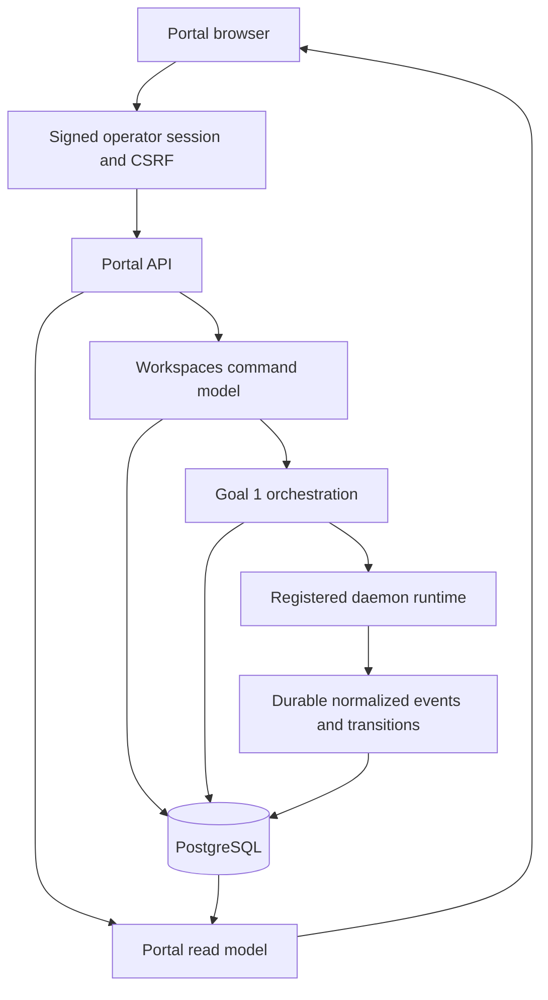
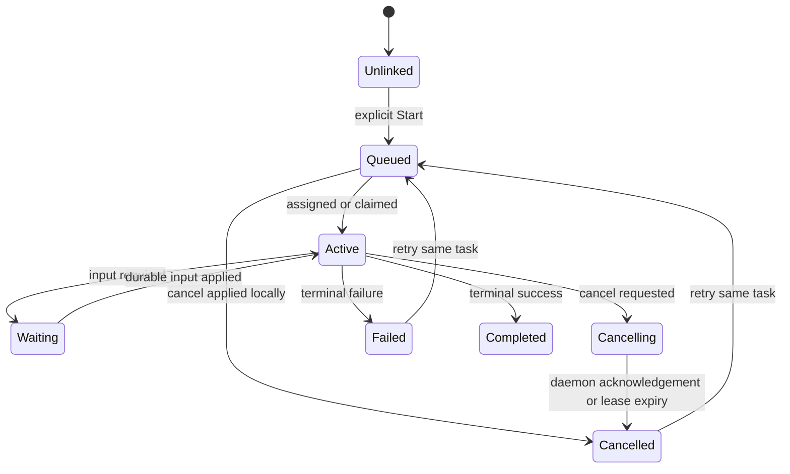
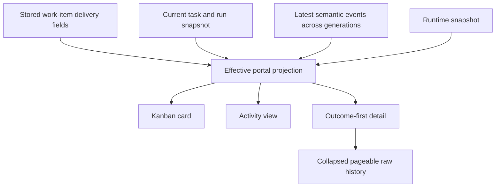

# Complete Engineering Workspace Portal - Plan

## Goal Capsule

- **Objective:** Turn the existing Goal 2 portal skeleton into a complete daily engineering workspace whose individual features finish their intended jobs, not merely render or return successful HTTP responses.
- **Means:** Complete the project, resource, work-item, Kanban, execution, activity, delivery, health, and progressive-disclosure flows on the existing Phoenix/EEx/JavaScript surface and durable Goal 1 orchestration model.
- **Authority:** `docs/goals/02-goal.md` defines the product outcome; `docs/protocol-v1.md` and Goal 1 orchestration behavior define the execution boundary.
- **Execution profile:** Implement feature slices test-first where behavior changes, then verify every acceptance flow through context/API tests and a real browser; run a live daemon workflow for execution-specific proof.
- **Stop conditions:** Every in-scope acceptance example passes, no visible control is a placeholder, the full control and daemon gates pass, production assets are present, and the Compose topology either passes live validation or has a concrete external environment blocker recorded.
- **Tail ownership:** Keep the completed work in the current working tree. Commit, push, and PR creation require separate user authorization.

---

## Product Contract

### Summary

The portal must let an operator manage projects and engineering resources, operate a real Kanban, assign work to humans or agents, supervise durable agent execution, inspect outcome-level delivery information, and advance work through review and completion without falling back to raw orchestration APIs.

### Problem Frame

The current implementation establishes authentication, a project/work-item schema, a Kanban shell, basic mutations, and an execution drawer. It does not yet close several user journeys: project settings cannot be maintained, resources cannot be detached or express synchronization separately from connectivity, Kanban ordering is not durable, work-item editing is partial, terminal executions cannot be retried, active work has no real activity view, semantic agent output is not projected consistently, and most browser behaviors lack feature-level proof. Those gaps make the portal demonstrable but not dependable as a daily control surface.

### Actors

- A1. **Operator:** Authenticated user managing projects, work, delivery state, and agent execution.
- A2. **Human assignee:** Named owner of a work item that is managed without agent execution.
- A3. **Agent runtime:** Goal 1 runtime that claims durable tasks, streams events, waits for input, and reports terminal state.
- A4. **External engineering system:** A repository, tracker, CI system, or connection represented as project metadata in Goal 2; provider authentication and synchronization belong to Goal 3.

### Requirements

**Workspace and resources**

- R1. An operator can create, select, edit, archive, and restore a project, including its name, description, default agent profile, and default workspace binding; the project key remains immutable after creation so work-item references do not silently change.
- R2. A project can attach, edit, and detach multiple independently typed engineering resources without being hard-bound to one repository; runtime and agent resources can reference registered runtime/profile identities rather than existing only as free-form labels.
- R3. Resource connectivity and synchronization are distinct states with timestamps and an actionable status message, so a healthy connection with stale or failed sync is representable.
- R4. Project and resource mutations detect stale browser state and return a conflict rather than silently overwriting a newer operator update.

**Work management**

- R5. An operator can create and fully edit a work item, including title, description, priority, workflow state, repository, workspace override, branch, pull request, CI, review, blocker, and human or agent ownership.
- R6. Ownership invariants are enforced: human ownership has a human name, agent ownership resolves an agent profile, and unassignment does not retain misleading owner data.
- R7. Blocker and delivery fields remain internally consistent; clearing a blocker clears its explanation, invalid URLs are rejected, and invalid mutations leave persisted state unchanged.
- R8. Kanban moves persist both column and exact order, support mouse and keyboard-accessible movement, survive reload, and serialize concurrent moves without losing cards.
- R9. Search and board filters return the correct work-item subset and preserve the selected project and active view during refresh.

**Agent execution**

- R10. Agent ownership is metadata until the operator explicitly starts execution; Start creates one durable orchestration task, uses the resolved project/item agent and workspace bindings, and provides visible queued or active feedback.
- R11. Active work supports waiting-for-input and cancellation through Goal 1 durable commands with duplicate-submit protection and state-aware controls.
- R12. Failed or cancelled work can be retried on the same durable task so a new run generation preserves earlier history; active or completed work cannot be retried accidentally.
- R13. The portal exposes an activity view that maps active runs to work items, runtimes, generations, elapsed state, and the action currently needed from the operator.
- R14. A work-item state remains distinct from execution state; terminal agent execution never silently marks review or delivery complete, while the UI clearly proposes the next human workflow action.
- R26. Execution-defining fields are editable before launch, read-only while a task is queued or active, editable again after failure or cancellation, and copied atomically into the same task when Retry is accepted; completed execution requires a new work item.
- R27. Start, cancel, retry, and input actions carry stable client action IDs. Cancel identity is scoped to the current generation, input identity is scoped to the waiting request, and a lost response can be retried without creating a second action.

**Outcomes, delivery, and health**

- R15. Normalized agent events for progress, findings, artifacts, tests, pull requests, CI, review, and input requests remain durable and feed a stable portal read model across run generations.
- R16. Work-item cards and details show effective execution, pull-request, CI, review, and blocker state at a glance, using explicit work-item values when set and normalized agent evidence otherwise.
- R17. Run detail prioritizes the goal, current meaningful phase, summary, findings, artifacts, tests, delivery state, blocker, and completion result; raw events remain collapsed and pageable rather than truncated permanently.
- R18. Connection, project-compatible runtime, execution, and synchronization health are calculated from their owning signals and visibly distinguish working, waiting for a human, runtime offline, connection degraded, CI failed, and orchestration failure.
- R28. Semantic agent events use a versioned, size-bounded schema with explicit accumulation and replacement rules, source provenance, and current-generation precedence; prior-generation evidence remains historical but cannot masquerade as current delivery state.
- R29. Work-item repository references point to resources owned by the same project, and referenced resources cannot be detached until the reference is cleared or replaced.

**Interaction quality and safety**

- R19. Board, Activity, and Resources are real navigable views with complete loading, empty, success, conflict, and failure states; navigation controls do not merely scroll to incidental side-rail content.
- R20. Dialogs, drawers, menus, drag alternatives, focus restoration, labels, live announcements, and responsive layouts remain usable by keyboard and at desktop and mobile widths without overlap or hidden actions.
- R21. Portal reads and mutations require the signed operator session; mutations require CSRF protection; server-rendered and client-rendered values remain escaped; URLs are limited to HTTP(S).
- R22. Refresh and mutation races cannot let an older response overwrite a newer user action, and failed optimistic mutations reload authoritative state while preserving an actionable error message.
- R30. A project with queued or active execution cannot be archived; an archived project remains discoverable and restorable, is otherwise read-only, and never hides work that still needs an operator action.
- R31. Portal sessions have a bounded lifetime, use secure production cookie settings, renew on login, terminate on logout, and become invalid when the configured operator token rotates.
- R32. Product-quality acceptance covers scanability, hierarchy, density, action clarity, state distinction, and visual consistency for representative empty, loading, populated, conflict, failure, active, waiting, review, and done states.
- R33. Request ownership is explicit per surface: project loads, work-item detail loads, and mutation follow-ups ignore or abort responses that no longer belong to the selected project, item, view, or latest action.

**Completion evidence**

- R23. Each feature is proven by behavior-specific tests that assert persisted outcomes and state transitions, not only status codes or process startup.
- R24. A live workflow proves create project, attach resources, create/edit/move work, assign to an actual daemon, observe progress, answer an input request, inspect terminal outcome, record PR/CI/review state, retry a failed or cancelled run, and complete the card through the portal.
- R25. The production release contains portal assets and migrations, and the trusted-local Compose topology is configuration-valid and live-smoked whenever the local Docker engine is available.
- R34. A repository-owned Playwright suite runs the real `portal.js` workflows against deterministic fixtures at desktop and mobile widths, including two-context stale-update coverage, and writes screenshots and traces for failures.

### Key Flows

- F1. **Project setup**
  - **Trigger:** A1 enters an empty portal.
  - **Steps:** Create a project, edit its defaults, attach several resource types, verify separate connection and sync health, switch away and back.
  - **Outcome:** The project remains selectable with persisted settings and resources.
  - **Covered by:** R1-R4, R18-R22.
- F2. **Human-owned work**
  - **Trigger:** A1 creates work for A2.
  - **Steps:** Set complete work metadata, assign a human, reorder the card, move it through workflow states, and edit delivery details.
  - **Outcome:** Reload preserves the exact card state and order without creating execution state.
  - **Covered by:** R5-R9, R14, R22.
- F3. **Agent-owned execution**
  - **Trigger:** A1 explicitly starts a ready item whose owner type is Agent.
  - **Steps:** Resolve agent/workspace settings, create the durable task, schedule and claim it, display active run/runtime information, and stream meaningful progress.
  - **Outcome:** The card and Activity view identify the actual execution without exposing low-level mechanics.
  - **Covered by:** R10, R13-R18.
- F4. **Human decision**
  - **Trigger:** A3 enters `waiting_for_input`.
  - **Steps:** Show the question, accept one durable response, reject duplicates or stale submissions, and resume execution.
  - **Outcome:** The decision and resumed progress are visible in meaningful history.
  - **Covered by:** R11, R15, R17, R22.
- F5. **Cancellation and retry**
  - **Trigger:** A1 cancels queued or running agent work, or A3 fails.
  - **Steps:** Apply the state-appropriate cancel behavior, show the terminal result, enable retry only when legal, and create a later run generation on the same task.
  - **Outcome:** Earlier history remains intact and the new attempt is independently observable.
  - **Covered by:** R11-R14, R17.
- F6. **Delivery review**
  - **Trigger:** A3 reports artifacts or a change and completes.
  - **Steps:** Project semantic events into summary, changed artifacts, tests, pull request, CI, and review state; let A1 correct or supplement those values and move the item through review to done.
  - **Outcome:** Completion can be understood and approved without opening raw trace data.
  - **Covered by:** R14-R17, R24.
- F7. **Failure diagnosis**
  - **Trigger:** A resource, runtime, sync, CI run, or orchestration task fails.
  - **Steps:** Present the failure under the correct health category, expose detail and recovery action, and avoid labeling unrelated systems as failed.
  - **Outcome:** A1 can tell what is broken and what action is available.
  - **Covered by:** R3, R13, R16-R18.
- F8. **Concurrent operators and refresh**
  - **Trigger:** Two portal tabs edit or move the same object while background refresh is active.
  - **Steps:** Accept one current mutation, reject stale writes, ignore superseded reads, reload authoritative state, and keep focus/error feedback coherent.
  - **Outcome:** No silent overwrite or visual rollback occurs.
  - **Covered by:** R4, R8, R22.
- F9. **Archive and restore**
  - **Trigger:** A1 archives a project with no queued or active execution.
  - **Steps:** Remove it from the active default selection, keep it in an archived-project picker, block ordinary edits, restore it, and reload.
  - **Outcome:** All project resources, work items, and execution history remain intact and usable after restore.
  - **Covered by:** R1, R30.

### Acceptance Examples

- AE1. Given an empty authenticated portal, when an operator creates a project and reloads, then that project is selected and all editable defaults persist.
- AE2. Given a project with a healthy Git connection and a stale CI sync, when health renders, then Connections is healthy while Sync requires attention.
- AE3. Given three work items in Ready, when the middle card is moved before the first card and the page reloads, then the new order is preserved exactly.
- AE4. Given a human-owned work item, when it is edited and moved through review to done, then no orchestration task is created.
- AE5. Given a ready agent-owned item with an agent profile and workspace, when Start is selected, then one durable task is created and the Activity view links the work item, current run generation, and runtime.
- AE6. Given a run waiting for input, when an operator submits one answer twice, then one durable input command exists and the second submission cannot create another pending command.
- AE7. Given a running task, when the operator cancels it, then the UI shows cancelling until the daemon acknowledges cancellation and then offers Retry.
- AE8. Given a failed or cancelled task, when Retry is selected, then the same task queues a later generation and both attempts remain in the timeline.
- AE9. Given semantic events for a finding, changed artifact, test result, pull request, and CI state, when detail loads, then each appears in its outcome section while raw output remains collapsed and older history can be loaded.
- AE10. Given an old browser copy of a work item, when a newer tab saves first, then the old save receives a conflict, reloads current state, and reports that the item changed elsewhere.
- AE11. Given desktop and mobile viewports, when every dialog, view, card action, and drawer is exercised by keyboard, then controls remain reachable, labeled, visible, and non-overlapping.
- AE12. Given the production Compose stack with its fake agent, when the full workflow runs, then a browser can complete F1-F7 and persisted state remains correct after the control service restarts.
- AE13. Given a linked active task, when an operator tries to edit title, description, repository, agent profile, or workspace, then the mutation is rejected; after failure or cancellation the edit is accepted and Retry executes the updated intent.
- AE14. Given an input or cancel request whose HTTP response is lost, when the browser retries with the same action ID, then the original command is replayed; a later generation or waiting request uses a different action identity.
- AE15. Given prior-generation failed CI evidence and a new retry generation, when the new attempt is queued or active, then the old CI failure appears only in history until the new generation reports CI state.
- AE16. Given a selected project with an active run, when archive is requested, then the portal rejects it and keeps the project selected; after the run is terminal, archive and restore both survive reload.
- AE17. Given two browser contexts plus delayed detail and workspace responses, when selection and mutations race, then the latest context remains visible and a stale response cannot replace it.

### Scope Boundaries

**In scope**

- Complete the existing native Phoenix/EEx/CSS/JavaScript portal and its Goal 1 orchestration integration.
- Add the minimum durable data and read-model support needed for complete Goal 2 workflows.
- Extend the daemon's normalized JSONL event contract where outcome-level portal behavior otherwise cannot work.

**Deferred to Follow-Up Work**

- Goal 3 provider authentication, webhooks, polling, remote source-of-truth rules, and live GitHub/Azure DevOps synchronization.
- Goal 4 chat, conversational status queries, guidance, pause, and resume controls.
- Organization-scale RBAC, audit exports, notifications, dashboards, and cross-project portfolio planning.

**Outside this product increment**

- Replacing the existing Phoenix application with a JavaScript framework or adding a Node asset build solely for the portal.
- Treating external provider credentials or repository credentials as portal-managed secrets.

---

## Planning Contract

### Key Technical Decisions

- KTD1. **Preserve the Goal 2 boundary.** Resource and delivery metadata are fully manageable and diagnosable in Goal 2, but provider authentication and automated remote synchronization remain Goal 3 work; portal contracts must leave room for those later adapters without pretending manual state is live provider data. Governs R2-R3, R15-R18.
- KTD2. **Use separate connectivity and synchronization projections.** Keep resource connectivity as the existing health dimension and add a distinct sync state, timestamps, and message so the four top-level health signals have non-overlapping ownership. Limit runtime health to registered runtimes compatible with the selected project's bindings and defaults. Governs R2-R3, R18.
- KTD3. **Keep one durable task per work item and add a legal terminal retry.** Retry re-queues only failed or cancelled tasks under a lock, preserves earlier runs, clears terminal task output for the new attempt, and lets the scheduler create the next generation. Completed work requires an explicit new work item rather than an accidental rerun. Governs R10-R14.
- KTD4. **Build a batched portal read model.** Resolve task/run/waiting/runtime and latest semantic delivery events for all selected-project work items in bounded queries, then serialize cards, Activity, health, and detail from the same projection. Avoid per-card orchestration lookups and avoid write-time coupling from Goal 1 into Workspaces. Governs R13, R15-R18, R22.
- KTD5. **Make Kanban order transactional.** A move operation locks the project's current work items, validates the destination anchor, rewrites deterministic positions, and returns the authoritative projection. Column and order changes are one operation rather than independent best-effort patches. Governs R8, R22.
- KTD6. **Use explicit mutation versions.** Projects, resources, and work items expose a version and mutation endpoints require the caller's expected version; stale mutations return a conflict that the browser resolves by reloading. Governs R4, R22.
- KTD7. **Normalize agent evidence without provider coupling.** The daemon preserves known semantic JSONL event types and the portal folds them into outcome and delivery projections across generations. Unknown records and raw output remain durable for diagnostics. Governs R15-R17.
- KTD8. **Keep the frontend dependency-free.** Continue with server-rendered HTML and a single native JavaScript controller, but organize it around explicit view/render/action boundaries, abortable sequenced requests, and accessible non-drag alternatives. Governs R8-R9, R19-R22.
- KTD9. **Test outcomes at every seam.** Context tests prove transactions and invariants, controller tests prove browser API contracts and security, daemon tests prove normalized event delivery, and a real browser plus live daemon proves each user flow. Startup-only smoke tests never satisfy R23-R25.
- KTD10. **Freeze active execution intent.** Before launch the work item owns execution-defining fields. While queued or active those fields are immutable. A failed or cancelled Retry atomically refreshes the durable task work payload from the current work item before re-queuing it. Governs R26.
- KTD11. **Scope control idempotency to lifecycle identity.** Browser-generated action IDs are retained in session storage until an authoritative response; server keys combine the action kind, task, current generation, and waiting transition where applicable. Existing command replay remains the source of truth after response loss. Governs R11-R12, R27.
- KTD12. **Specify a semantic event contract.** Version 1 events cap encoded payloads at 64 KiB. Findings and artifacts accumulate by stable event identity within a generation; summary, pull request, CI, and review use latest-event ordering; tests use the latest result per test name. Explicit work-item delivery values are nullable overrides with manual provenance and may be cleared to resume agent-derived state. Governs R15-R17, R28.
- KTD13. **Add a test-only browser harness without an asset build.** A separate `browser/` Playwright package drives the shipped static portal against a dedicated test database and fake daemon. It does not bundle production assets or introduce a frontend framework. Governs R23-R25, R32-R34.
- KTD14. **Bind sessions to credential state.** Store issuance time and a one-way operator-token fingerprint in the signed session, enforce an eight-hour absolute lifetime, renew the cookie at login, drop it at logout, and use `Secure` cookies in production. Governs R21, R31.

### High-Level Technical Design

The Kanban workflow remains a separate human-controlled state machine (`backlog`, `ready`, `in_progress`, `review`, `done`). Execution state informs recommended actions and attention signals but does not silently complete human review.

### Assumptions

- One configured operator credential and one operator permission level remain sufficient for Goal 2.
- External resource and delivery state may be entered manually in Goal 2, but the UI must label it as observed/manual state rather than imply a live provider sync.
- Project archiving is reversible and does not delete work, resources, tasks, or run history.
- Project archiving is rejected while a linked task is queued or active; archived projects allow only read, restore, cancel, and required-input actions.
- Work-item completion remains an operator decision after execution; the portal may recommend Review after successful execution but does not auto-complete the card.

### System-Wide Impact

- **Operators:** Receive complete project/work/execution flows and explicit conflict/error recovery.
- **Daemon authors:** Gain a documented semantic event vocabulary while retaining raw-event compatibility.
- **Goal 1 protocol:** Gains a narrowly scoped terminal retry operation and semantic event preservation without weakening fencing, leases, idempotency, or durable history.
- **Future Goal 3 adapters:** Can populate the same resource and delivery projections without changing portal concepts.
- **Operations:** Gain health states that point to the failing subsystem and a repeatable release/Compose verification path.

### Risks and Mitigations

| Risk | Mitigation |
| --- | --- |
| Retry weakens Goal 1 lifecycle guarantees | Lock the task, allow only failed/cancelled states, preserve prior runs, and add concurrency and illegal-state tests. |
| Portal aggregation introduces N+1 queries | Build one batched read model for the selected project and assert bounded query behavior where practical. |
| Manual provider fields look like live sync | Separate health from sync, show timestamps/source labels, and keep Goal 3 behavior explicitly out of scope. |
| Drag-and-drop loses order under concurrent refresh | Use one transactional move endpoint, expected versions, request sequencing, and reload-on-conflict. |
| Rich event payloads create an XSS surface | Keep all dynamic content text-escaped and validate every rendered URL server-side. |
| Browser behavior lacks a repository-native JS runner | Put business invariants behind tested APIs, keep JS orchestration thin, and execute a documented browser matrix against a live server on desktop and mobile. |
| Docker Desktop remains unavailable on the workstation | Run `docker compose config` unconditionally, preserve full non-Docker release evidence, and report the exact engine blocker rather than claiming a live Compose pass. |

---

## Implementation Units

### U1. Complete durable workspace invariants

- **Goal:** Add the persistent fields and transactional context operations required for correct project, resource, work-item, ordering, and concurrent-update behavior.
- **Requirements:** R1-R8, R22, R26, R29-R30.
- **Dependencies:** None.
- **Files:** `control/priv/repo/migrations/20260904010000_complete_engineering_workspace.exs`, `control/lib/symmetry_control/workspaces/schemas.ex`, `control/lib/symmetry_control/workspaces.ex`, `control/test/symmetry_control/workspaces_test.exs`.
- **Approach:** Add mutation versions, distinct resource sync fields, nullable manual delivery overrides, repository-resource references, and transactional commands for project updates, guarded archive/restore, reference-safe resource removal, complete work-item updates, and exact Kanban moves. Enforce active-task field locks and normalize assignment and blocker fields inside the owning context rather than relying on browser cleanup.
- **Execution note:** Start with failing context tests for invariants, stale writes, order persistence, and concurrent moves.
- **Patterns to follow:** Ecto transactions and row locks in `control/lib/symmetry_control/orchestration.ex`; changeset constraint coverage in existing workspace and orchestration tests.
- **Test scenarios:**
  - Create and update every mutable project setting with the expected version; reject a key mutation, and make a stale version preserve the winning update.
  - Archive and restore a project without deleting resources or work items.
  - Reject archive while a linked task is queued or active, then permit it after terminal state.
  - Attach multiple resources of different kinds, edit connectivity and sync independently, and detach one without affecting siblings.
  - Reject detach of a repository referenced by a work item and reject a cross-project repository reference.
  - Reject invalid resource URLs, invalid sync values, and blank status messages where a failure requires context.
  - Create human, agent, and unassigned work items and verify normalized owner fields.
  - Clear a blocker and verify its explanation is cleared in storage.
  - Move cards within one column and across columns; reload returns exact deterministic order.
  - Race two moves or updates and verify one authoritative result with no lost or duplicated card.
- **Verification:** Context APIs return stable domain errors, database constraints mirror changeset rules, and persisted snapshots match the requested final state.

### U2. Complete project, resource, and work-item browser APIs

- **Goal:** Expose the U1 command model through coherent, authenticated JSON contracts with actionable error semantics.
- **Requirements:** R1-R9, R19, R21-R23, R26-R31.
- **Dependencies:** U1.
- **Files:** `control/lib/symmetry_control_web/router.ex`, `control/lib/symmetry_control_web/controllers/portal_api_controller.ex`, `control/lib/symmetry_control_web/portal_json.ex`, `control/lib/symmetry_control_web/protocol.ex`, `control/test/symmetry_control_web/controllers/portal_controller_test.exs`, `control/test/symmetry_control_web/controllers/portal_workflow_test.exs`.
- **Approach:** Add project update/archive/restore, reference-safe resource detach, work-item move, and complete edit endpoints. Give Start, Cancel, Retry, and Input explicit action-ID contracts. Return versions and normalized `404`, `409`, and `422` payloads consistently. Bind signed sessions to issuance time and the current operator-token fingerprint, and keep all mutations behind the portal session and CSRF pipeline.
- **Execution note:** Add controller contract tests before wiring each browser action.
- **Patterns to follow:** Existing `PortalApiController.error/2`, `PortalJSON.changeset_errors/1`, and operator protocol error mapping.
- **Test scenarios:**
  - Every new endpoint rejects an unauthenticated request and every mutation rejects a missing or invalid CSRF token in an actual endpoint test.
  - Valid project/resource/work-item operations return the authoritative updated DTO and version.
  - Missing IDs return `404`; malformed bodies return `400` or `422`; stale versions return `409` with a stable code.
  - Moving a card with a destination anchor from another project is rejected without changing either project.
  - Archived project selection and empty active-project states are deterministic.
  - Expired sessions and sessions created before an operator-token rotation are rejected and cleared.
- **Verification:** The API supports every non-execution UI action without direct database or Goal 1 API access.

### U3. Add a unified portal execution read model

- **Goal:** Supply cards, Activity, health, and details from one consistent projection of work items, task/run state, runtime ownership, and semantic execution evidence.
- **Requirements:** R13-R18, R22, R28-R29, R33.
- **Dependencies:** U1.
- **Files:** `control/lib/symmetry_control/workspaces/read_model.ex`, `control/lib/symmetry_control/workspaces.ex`, `control/lib/symmetry_control_web/controllers/portal_api_controller.ex`, `control/lib/symmetry_control_web/portal_json.ex`, `control/test/symmetry_control/workspaces_read_model_test.exs`, `control/test/symmetry_control_web/controllers/portal_workflow_test.exs`.
- **Approach:** Batch-load current tasks/runs, waiting context, compatible runtime identity, and normalized delivery events for selected-project task IDs. Fold only the current attempt into current delivery fields, keep earlier generations historical, merge nullable manual overrides with source provenance, and derive top-level health from the correct source categories. Return pageable raw history cursors from detail.
- **Patterns to follow:** Goal 1 runtime read models, task snapshot semantics, and keyset timeline pagination.
- **Test scenarios:**
  - A project with many linked work items yields correct execution summaries without per-item task queries.
  - Active runs map to the right work-item key, generation, runtime, and waiting action.
  - Explicit PR/CI/review values override inferred event values; absent explicit values fall back to semantic events.
  - A degraded CI resource does not mark connection health degraded; a failed sync does not mark runtime offline.
  - Failed execution, human wait, active execution, and idle execution produce distinct health states.
  - More than one page of raw history returns a stable cursor and no duplicate or missing entries across generations.
- **Verification:** Workspace and detail responses agree on execution and delivery state for the same work item.

### U4. Complete durable execution controls and semantic agent events

- **Goal:** Make start, wait, cancel, fail, retry, and completion usable end to end while preserving Goal 1 guarantees and producing outcome-level evidence.
- **Requirements:** R10-R17, R21-R28.
- **Dependencies:** U1, U3.
- **Files:** `control/lib/symmetry_control/orchestration.ex`, `control/lib/symmetry_control_web/controllers/portal_api_controller.ex`, `control/lib/symmetry_control_web/router.ex`, `control/test/symmetry_control/orchestration_test.exs`, `control/test/symmetry_control/orchestration_review_test.exs`, `control/test/symmetry_control_web/controllers/portal_workflow_test.exs`, `daemon/internal/app/app.go`, `daemon/internal/app/app_test.go`, `daemon/cmd/symmetry-fake-agent/main.go`, `daemon/cmd/symmetry-fake-agent/main_test.go`, `daemon/e2e/core_test.go`, `docs/protocol-v1.md`.
- **Approach:** Add a locked, idempotent retry command for failed/cancelled tasks that refreshes the task work payload from the current card, expose it through a portal endpoint, and scope cancel/input keys to generation and waiting identity. Preserve size-valid versioned semantic JSONL event kinds while retaining unknown or oversized records as `agent_event` and non-JSON output as raw output. Extend the fake agent with a production-isolated `fail_once_then_evidence_success` fixture keyed by work-item identity so a retry can deterministically succeed without reconfiguration.
- **Execution note:** Treat Goal 1 lifecycle tests as a regression boundary; do not weaken lease, generation, fencing, or command constraints to make portal scenarios pass.
- **Patterns to follow:** Existing locked lifecycle operations, idempotency hashes, scheduler wake-up, daemon journal/outbox, and fake-agent scenarios.
- **Test scenarios:**
  - First launch creates one task; repeated launch while linked replays without duplication.
  - Cancel queued, assigned, running, and waiting work through their existing state-specific paths.
  - Retry failed and cancelled tasks concurrently; one retry wins, the task queues once, and the scheduler creates exactly one later generation.
  - Reject retry for queued, active, waiting, cancelling, and completed tasks.
  - A semantic event of each supported kind is preserved with its declared kind and payload; unknown JSON and raw output retain compatibility.
  - Oversized or schema-invalid semantic events remain diagnostic data and never overwrite current outcome projections.
  - A live fake-agent scenario emits findings, artifacts, tests, and delivery events that survive daemon restart/reconciliation and appear in portal detail.
- **Verification:** One live work item can traverse launch, execution, input, cancellation or failure, retry, later completion, and multi-generation history without changing task identity.

### U5. Finish portal views and interactions

- **Goal:** Replace partial controls and anchor-only navigation with complete Board, Activity, and Resources workflows while preserving the existing restrained product style.
- **Requirements:** R1-R22, R26-R34.
- **Dependencies:** U2-U4.
- **Files:** `control/lib/symmetry_control_web/portal_html/index.html.eex`, `control/priv/portal_assets/portal.js`, `control/priv/portal_assets/portal.css`, `control/test/symmetry_control_web/controllers/portal_controller_test.exs`.
- **Approach:** Add project settings plus archived discovery, full work-item edit with active-intent locks, reference-safe resource detach, exact Kanban placement, state-aware Start/Cancel/Retry actions, active-run inspection, resource health/sync management, manual-override provenance, and history pagination. Organize client state around the active view and selected object, persist in-flight action IDs until an authoritative response, use expected versions on writes, give every surface its own request ownership, and provide keyboard actions wherever drag is offered.
- **Patterns to follow:** Existing EEx shell, DOM escaping helpers, submit locks, request sequence guard, native dialogs, and responsive CSS variables.
- **Test scenarios:**
  - F1-F8 render the expected controls and update the visible authoritative state after success.
  - Mutation buttons disable while pending; duplicate click/submit does not create duplicate objects or commands.
  - A server validation error stays attached to the current dialog/drawer workflow and does not discard entered data.
  - A stale conflict reports the conflict, reloads current data, and never redraws the rejected state.
  - Delayed A-to-B drawer loads, project switches, refreshes during form edits, and late mutation responses cannot replace the latest visible context.
  - Hash navigation opens Board, Activity, or Resources as a real view and remains stable across refresh and project switching.
  - Keyboard users can open cards, change column/order, operate dialogs, close the drawer, and regain focus.
  - Desktop, tablet, and mobile layouts keep all controls readable and avoid horizontal clipping or overlapping text.
- **Verification:** Every visible control completes its named action, every state has an understandable empty/loading/error presentation, and there are no decorative or placeholder-only navigation affordances.

### U6. Prove every feature through API and browser workflows

- **Goal:** Convert the Goal 2 completion claim into a repeatable feature matrix with persisted-state assertions and real browser evidence.
- **Requirements:** R23-R25, R32-R34; covers AE1-AE17.
- **Dependencies:** U2-U5.
- **Files:** `browser/package.json`, `browser/package-lock.json`, `browser/playwright.config.mjs`, `browser/tests/portal.spec.mjs`, `browser/README.md`, `.gitignore`, `control/test/symmetry_control_web/controllers/portal_workflow_test.exs`, `control/test/symmetry_control/workspaces_read_model_test.exs`, `daemon/e2e/core_test.go`, `docs/goal-02-runbook.md`, `README.md`, `control/README.md`.
- **Approach:** Add a repository-owned Playwright harness with unique per-test project keys, browser login through the real CSRF flow, desktop/mobile projects, a two-context conflict scenario, and failure screenshots/traces. Expand integration tests around complete user journeys instead of isolated status-code checks. Exercise the daemon-backed path with the deterministic fake-agent retry scenario.
- **Test scenarios:**
  - Covers AE1-AE17 individually with recorded expected visible and persisted outcomes.
  - Verify authentication, logout, session expiry, and CSRF failures from a real HTTP client.
  - Verify all board filters, search combinations, empty states, and failure recovery.
  - Verify runtime offline, connection degraded, sync failed, CI failed, waiting for input, and orchestration failure are visually distinct.
  - Verify raw history remains collapsed by default and pagination exposes older events without flooding the normal detail view.
- **Verification:** A feature matrix records pass/fail evidence for each requirement and acceptance example; no row is satisfied by startup or page-load proof alone.

### U7. Close release, migration, and Compose gates

- **Goal:** Prove the completed portal works from a fresh database and production artifact, and expose any host-level Docker blocker precisely.
- **Requirements:** R23-R25.
- **Dependencies:** U1-U6.
- **Files:** `control/priv/repo/migrations/20260904010000_complete_engineering_workspace.exs`, `docker/control.Dockerfile`, `compose.yaml`, `compose.production.yaml`, `docs/goal-02-runbook.md`.
- **Approach:** Validate forward and rollback migration behavior on disposable databases, build the production release, inspect packaged portal assets, validate both Compose files, then start the trusted-local topology and run the browser/API/daemon smoke flow when the engine is reachable.
- **Execution note:** This unit is packaging and environment heavy; use fresh-state and runtime evidence rather than adding speculative abstractions.
- **Test scenarios:**
  - Fresh migration creates every constraint and index needed by U1-U4.
  - Upgrade from the current Goal 2 schema preserves existing projects, resources, work items, and task links.
  - Rollback removes only the follow-up schema additions without touching Goal 1 data.
  - Production release serves HTML, CSS, JavaScript, API, and migrations without development-only paths.
  - Compose config resolves successfully; live startup reaches healthy Postgres/control/daemon and completes AE12.
- **Verification:** Full control and daemon suites pass, release and fresh migration pass, and Compose evidence is explicit rather than inferred.

---

## Verification Contract

| Gate | Scope | Done signal |
| --- | --- | --- |
| Workspace context tests | U1, U3 | All domain invariants, stale writes, ordering, and read-model projections pass with persisted-state assertions. |
| Portal controller tests | U2-U6 | Every browser API contract, auth/CSRF boundary, error shape, and full workflow scenario passes. |
| Goal 1 control regression | U4, U7 | Full `control` test suite passes; the two historical fixture failures are corrected rather than waived. |
| Daemon unit and E2E tests | U4, U6-U7 | All Go tests pass, including semantic events, wait/input, cancellation, retry generation, reconciliation, and output durability. |
| Formatting and compilation | All code units | Elixir formatting, warnings-as-errors compilation, JavaScript syntax checking, Go formatting, and Go vet pass. |
| Browser desktop matrix | U5-U6 | The repository Playwright desktop project passes AE1-AE11 and AE13-AE17 with persisted-state assertions, no console errors, and retained failure artifacts. |
| Browser mobile matrix | U5-U6 | The repository Playwright mobile project passes the applicable acceptance rows with no hidden primary action, clipping, or focus trap. |
| Product-quality rubric | U5-U6 | Independent review records pass/fail evidence for scanability, hierarchy, density, action clarity, state distinction, and consistency across representative states. |
| Release and migration | U1, U7 | Fresh and upgrade migrations pass; the production release contains and serves portal assets. |
| Compose validation | U7 | Both Compose files parse; when the engine is available, the stack starts and AE12 passes. |

---

## Definition of Done

- Every requirement R1-R34 is implemented or has explicit evidence that its owning behavior already existed and remains regression-covered.
- Every acceptance example AE1-AE17 has a recorded passing test or browser run that checks visible behavior and persisted state.
- Projects, resources, work items, Kanban order, execution controls, Activity, health, and outcome detail have no visible placeholder controls or dead-end actions.
- Agent execution supports launch, wait/input, cancel, failure, retry, later generation, and completion while preserving Goal 1 durability guarantees.
- Outcome-level information is populated from real semantic execution evidence; raw history stays available through collapsed progressive disclosure and pagination.
- Authentication, CSRF, URL validation, XSS boundaries, stale-write handling, and request-order races have negative-path coverage.
- `mix format --check-formatted`, `mix compile --warnings-as-errors`, the full control test suite, `node --check control/priv/portal_assets/portal.js`, `gofmt`, `go vet ./...`, and `go test ./...` pass.
- Desktop and mobile browser matrices pass without console errors, inaccessible controls, overflow, or incoherent state changes.
- Fresh migration and production release checks pass; Docker Compose is live-validated unless the host engine itself is unavailable, in which case the exact blocker and all completed non-Docker evidence are recorded.
- Documentation describes actual supported workflows, semantic event contracts, health meanings, recovery actions, and verification steps.
- No commit, push, or pull request is created without separate authorization.
